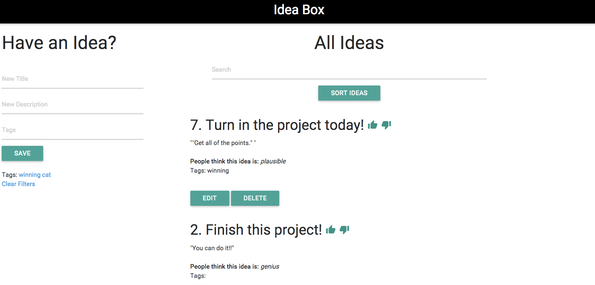

# Basics

### Github Repository for the Project:
[My Repo](https://github.com/amcrawford/idea-box.js)

### Link to the Deployed Application:
[My Application](https://cryptic-forest-91322.herokuapp.com/)

### Link to My Commits in the Github Repository for the Project
[My Commits](https://github.com/amcrawford/idea-box.js/commits/master)

### Screenshot of My Application

## Completion

### Were you able to complete the base functionality?
Yes, I was able to complete functionality.

### Which extensions, if any, did you complete?
I completed all three extensions with some small functionality issues.
* Inline Editing:
  Only saves on "Enter" keydown, not by clicking out of text-box.

    
* Tagging: Need to refresh after filtering by tag to view all ideas again.

    
* Sorting: Works in both directions but, cannot use other AJAX functions after sort until refreshing page (e.g. Thumbs-Up/ Edit).

    

# Code Quality

### Code I am Proud of:
I am really proud of my [sort functionality](https://github.com/amcrawford/idea-box.js/blob/master/app/assets/javascripts/sort_ideas.js).  It ended up being a fairly simple solution to a complex problem and was really excited to have it work out so easily.

### Code I am Not Especially Prout of:

I am not particularly excited about my solution for [changing quality](https://github.com/amcrawford/idea-box.js/blob/master/app/assets/javascripts/change_quality.js).  It was one of the first methods that I wrote and, while it definitely works, I am positive there is a more elegant solution.

### Test Suite

### Provide a link to an example, if you have one, of a test that covers an 'edge case' or 'unhappy path':
[Link to tests](https://github.com/amcrawford/idea-box.js/blob/master/test/integration/can_add_new_idea_test.rb#L22-L36)

-----
