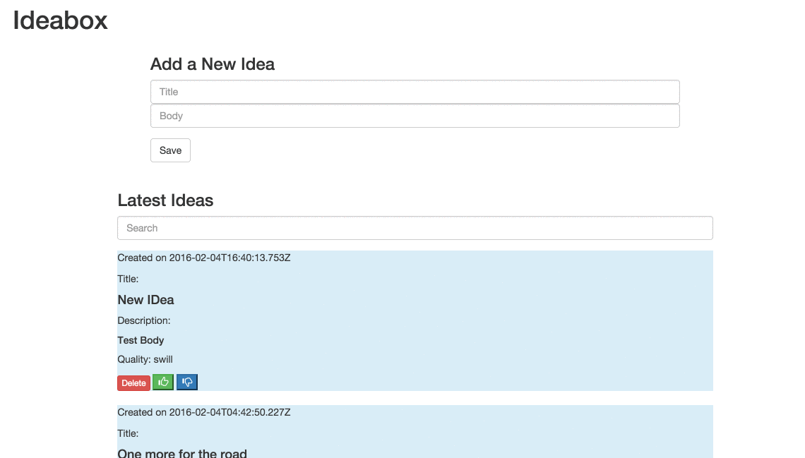

# Ideabox 2.0 Submission Form
[Project Spec](https://github.com/turingschool/curriculum/blob/master/source/projects/revenge_of_idea_box.markdown)

------

# Basics

### Link to the Github Repository for my Project
[My Repo](https://github.com/MattRooney/ideabox)

### Link to the Deployed Application
[My Application](http://rooneys-ideabox.herokuapp.com/)

### Link to Your Commits in the Github Repository for the Project
[My Commits](https://github.com/MattRooney/ideabox/commits/master)

### A Screenshot of My Application

## Completion

### Were you able to complete the base functionality?
- Yes
#### If not, list what functionality is missing.

### Which extensions, if any, did you complete?
- Inline edit
### Attach a .gif, or images of any extensions work being used on the site.

# Code Quality

### Link to a specific block of your code on Github that you are proud of
[My Good Code](https://github.com/MattRooney/ideabox/blob/master/app/assets/javascripts/editIdea.js)
#### Why were you proud of this piece of code?
Because edit was easily the hardest of the crud functionality, and after I got past this I understood how
to approach the rest of the project much more clearly. Though it needs some refactoring.

### Link to a specific block of your code on Github that you feel not great about
[My bad code](https://github.com/MattRooney/ideabox/blob/master/app/assets/javascripts/thumbsUpDown.js)

#### Why do you feel not awesome about the code? What challenges did you face trying to write/refactor it?
These two functions work and I feel like they work well. I'm proud that I got them to work but, the code is ugly. If else if else always makes
me feel guilty. Also, I know it can be refactored but I just ran out of time.
### Attach a screenshot or paste the output from your terminal of the result of your test-suite running.

### Provide a link to an example, if you have one, of a test that covers an 'edge case' or 'unhappy path'
...sad trombone...

### Please feel free to ask any other questions or make any other statements below!
Whatever my points total ends up being, I feel like I learned a LOT from this project.
