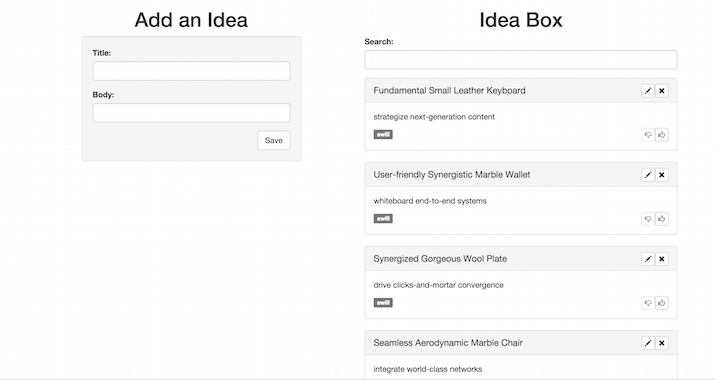
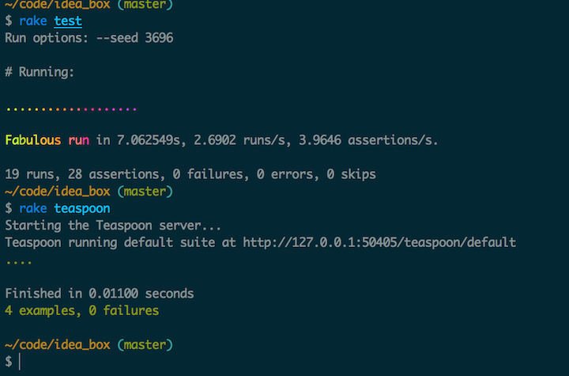

# Ideabox 2.0 Submission Form
[Project Spec](https://github.com/turingschool/curriculum/blob/master/source/projects/revenge_of_idea_box.markdown)

* Fork this repo, if you haven't already and check out a branch
* Use this README as a template to create a file in this folder with your name as the title.
* Submit a pull request
* Pro Tip: You can use [recordit.co](http://recordit.co/) to record interaction gifs.
* Secondary Pro Tip: [Here's how to link to specific line number(s) in Github](http://stackoverflow.com/questions/23821235/how-to-link-to-specific-line-number-on-github)
* Tertiary Pro Tip: You can re-use some of these things in your portfolio/resume

------

# Basics

### Link to the Github Repository for the Project
[patwey/idea_box](http://github.com/patwey/idea_box)

### Link to the Deployed Application
[ideabox-patwey](http://ideabox-patwey.herokuapp.com/)

### Link to Your Commits in the Github Repository for the Project
[Commits](http://github.com/patwey/idea_box/commits/master)

### Provide a Screenshot of your Application

## Completion

### Were you able to complete the base functionality?

Yes!

### Which extensions, if any, did you complete?

None!

# Code Quality

### Link to a specific block of your code on Github that you are proud of

[Pride](https://github.com/patwey/idea_box/blob/master/app/assets/javascripts/idea_renderer.js#L24)

#### Why were you proud of this piece of code?

This function, in along with the thumbsUpBtn and thumbsDownBtn allow me to change the update buttons so that they are appropriately enabled and disabled depending on their idea's quality.  Though there is some duplication in in the thumbsUpBtn and thumbsDownBtn methods, I think I did a decent job of breaking out the logic.

### Link to a specific block of your code on Github that you feel not great about

[Sadness](https://github.com/patwey/idea_box/blob/master/app/assets/javascripts/idea_editor.js#L33)

#### Why do you feel not awesome about the code? What challenges did you face trying to write/refactor it?

This represents an overarching problem that I didn't address - handling sad paths. As you can see, I don't address the instance of a failed request. I ran out of time, and prioritized adding happy paths over addressing sad ones (Because I'm a glass half-full kind of guy).

### Attach a screenshot or paste the output from your terminal of the result of your test-suite running.

### Provide a link to an example, if you have one, of a test that covers an 'edge case' or 'unhappy path'

[Truncation Edge Case](https://github.com/patwey/idea_box/blob/master/spec/javascripts/truncate_body_spec.js#L29)
