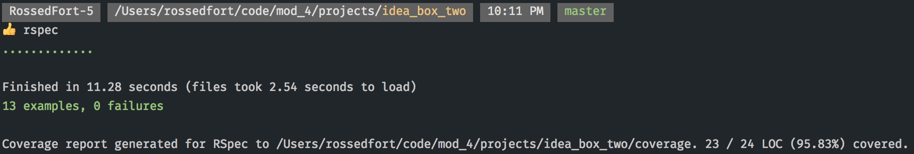

# Ideabox 2.0 Submission Form - Ross Edfort
[Project Spec](https://github.com/turingschool/curriculum/blob/master/source/projects/revenge_of_idea_box.markdown)
# Basics
[Github Repo](https://github.com/rossedfort/idea_box_two)

[Production Application](http://idea-box-v2.herokuapp.com/)

[My Commits](https://github.com/rossedfort/idea_box_two/commits/master)

## Completion

### Were you able to complete the base functionality?
Yes, I was able to complete all of the base functionality

### Which extensions, if any, did you complete?
I completed the inline editing extension

# Code Quality

### Link to a specific block of your code on Github that you are proud of
I was proud of my implementation of the [upvote](https://github.com/rossedfort/idea_box_two/blob/master/app/assets/javascripts/upvote_idea.js#L1-L26) and [downvote](https://github.com/rossedfort/idea_box_two/blob/master/app/assets/javascripts/downvote_idea.js#L1-L26) functions, which both make use of the same [renderNewQuality](https://github.com/rossedfort/idea_box_two/blob/master/app/assets/javascripts/render_new_quality.js#L1-L5) function and [buldPopUp](https://github.com/rossedfort/idea_box_two/blob/master/app/assets/javascripts/build_pop_up.js#L1-L4) function.
#### Why were you proud of this piece of code?
I was proud of this piece of code because I thought of an ideal solution in my mind, and tried to come up with a solution as close as possible to it. Originally, I was using an alert, which are "gross" according to Steve (I agree), to notifiy users when they couldn't upvote or downvote anymore. During our check-in, he suggested I implement a "flash message" type of notification, and I found a way to do so. I also was able to encapsulate the logic pretty well.

### Link to a specific block of your code on Github that you feel not great about
I'm not very proud of my [updateIdea](https://github.com/rossedfort/idea_box_two/blob/master/app/assets/javascripts/update_idea.js#L1-L33) function as it currently stands
#### Why do you feel not awesome about the code? What challenges did you face trying to write/refactor it?
This function is 33 lines, which seems a little too long. I'd love to revisit this and refactor out some of the repeated logic.
### Attach a screenshot or paste the output from your terminal of the result of your test-suite running.

### Provide a link to an example, if you have one, of a test that covers an 'edge case' or 'unhappy path'

Only my model [tests](https://github.com/rossedfort/idea_box_two/blob/master/spec/models/idea_spec.rb#L9-L17) have sad path coverage

### Please feel free to ask any other questions or make any other statements below!
I had a few questions during the project that I didn't have time to get answered:
* is there a shorthand syntax for AJAX put and delete calls? I am only aware of `$.post` and `.getJSON`/`$.get`
* why isn't my `event.preventDefault();` working [here](https://github.com/rossedfort/idea_box_two/blob/master/app/assets/javascripts/update_inline.js#L47)?
* In terms of convention, is it better to have more functions in less files? Or less functions in more files? Or something different entirely?
* How should a JSON response look for a sad path i.e. [this](https://github.com/rossedfort/idea_box_two/blob/master/app/controllers/api/v1/ideas_controller.rb#L14) Not only did I have trouble testing this, I feel as though it isn't quite right
* fun project 😁
