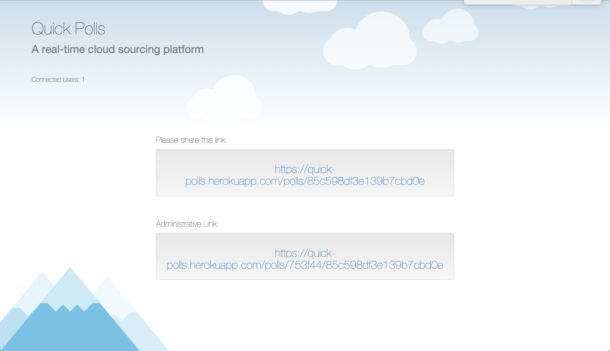

# Real-Time Submission Form
[Project Spec](https://github.com/turingschool/curriculum/blob/master/source/projects/real_time.markdown)

* Fork this repo, if you haven't already and check out a branch
* Use this README as a template to create a file in this folder with your name as the title.
* Submit a pull request
* Pro Tip: You can use [recordit.co](http://recordit.co/) to record interaction gifs.
* Secondary Pro Tip: [Here's how to link to specific line number(s) in Github](http://stackoverflow.com/questions/23821235/how-to-link-to-specific-line-number-on-github)
* Tertiary Pro Tip: You can re-use some of these things in your portfolio/resume

------

# Basics

### Link to the Github Repository for the Project
[cloud-source](http://github.com/adamki/real-time)

### Link to the Deployed Application
[cloud-source](http://cloud-source.herokuapp.com/)

### Link to Your Commits in the Github Repository for the Project
[Your Commits](https://github.com/adamki/real-time/commits/master)

### Provide a Screenshot of your Application

## Completion

### Were you able to complete what you feel is the base functionality?
#### If not, list what functionality you think may be missing missing.

I was not able to figure out how to use schedule a poll to close. I have since found out that
there is an [npm scheduler](https://www.npmjs.com/package/node-schedule). This would have been handy.

### What features did you complete which you feel 'exceeded expectations'?

My clouds

### Attach a .gif, or images of any extensions work being used on the site.

# Code Quality

### Link to a specific block of your code on Github that you are proud of
#### Why were you proud of this piece of code?

[look at this socket stufff](https://github.com/adamki/real-time/blob/master/server.js#L59-L79) It's so cool!!! im only proud of this in the sense that
if is my "very first websocket". Other than that, it is not terribly exceptional.

### Link to a specific block of your code on Github that you feel not great about
#### Why do you feel not awesome about the code? What challenges did you face trying to write/refactor it?
[testing!!!!](https://github.com/adamki/real-time/blob/master/test/server-test.js)

This testing didn't start until such a late time. I just didn't really get it down like I had hoped. It was rushed, and not excellent testing.

### Attach a screenshot or paste the output from your terminal of the result of your test-suite running.

-----

### Please feel free to ask any other questions or make any other statements below!
