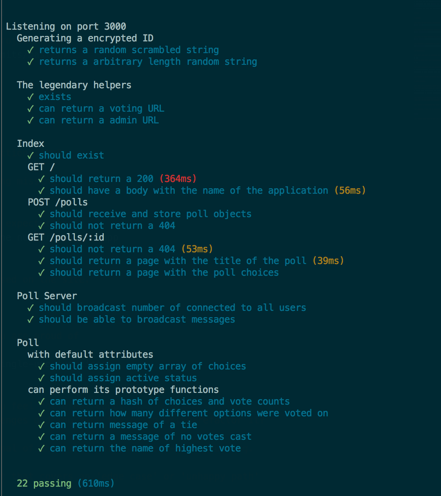

# Real-Time Submission Form
[Project Spec](https://github.com/turingschool/curriculum/blob/master/source/projects/real_time.markdown)

* Secondary Pro Tip: [Here's how to link to specific line number(s) in Github](http://stackoverflow.com/questions/23821235/how-to-link-to-specific-line-number-on-github)

------

# Basics

### Link to the Github Repository for the Project
[Your Repo](https://github.com/jasonpilz/crowdsource)

### Link to the Deployed Application
[Your Application](https://turingcrowdsource.herokuapp.com/)

### Link to Your Commits in the Github Repository for the Project
[Your Commits](https://github.com/jasonpilz/crowdsource/commits/master)

### Provide a Screenshot of your Application

## Completion

### Were you able to complete what you feel is the base functionality?
* Yes
#### If not, list what functionality you think may be missing.
* N/A

### What features did you complete which you feel 'exceeded expectations'?
* Integration with Twilio, poll creator can enter their phone number and the app
will send a text message with the winning poll result.

### Attach a .gif, or images of any extensions work being used on the site.

# Code Quality

### Link to a specific block of your code on Github that you are proud of
[Link](https://github.com/jasonpilz/crowdsource/blob/master/lib/poll.js#L19-L71)

#### Why were you proud of this piece of code?
* Spent time refactoring and splitting functionality into single-use functions,
kept methods to Sandi's recommendation of 5 lines max.

### Link to a specific block of your code on Github that you feel not great about
[Link](https://github.com/jasonpilz/crowdsource/blob/master/index.js#L93-L105)

#### Why do you feel not awesome about the code? What challenges did you face trying to write/refactor it?
* I wanted these methods outside of this file, into a helper file. I could not seem
to decouple the methods enough for them to work outside the file.

### Attach a screenshot or paste the output from your terminal of the result of your test-suite running.

### Provide a link to an example, if you have one, of a test that covers an 'edge case' or 'unhappy path'

-----

### Please feel free to ask any other questions or make any other statements below!
* Ask MEEKA why the conical link to code block not working!!!!!( 'y' not doing anything!)
* Also, what is the secret to separting socket and routing logic into separate files?
