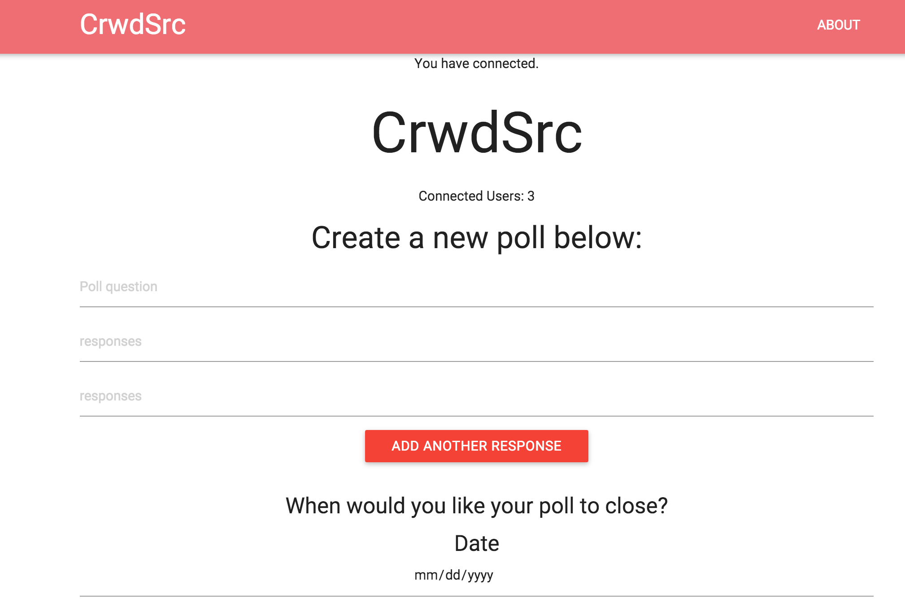
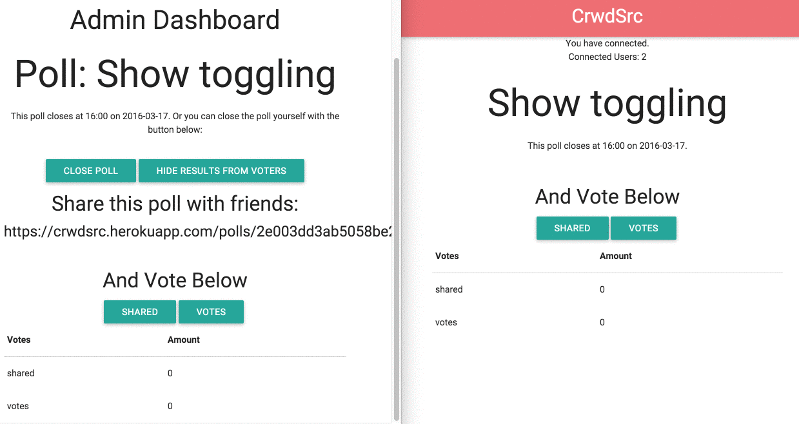

# Real-Time Submission Form
[Project Spec](https://github.com/turingschool/curriculum/blob/master/source/projects/real_time.markdown)

# Basics

### Link to my Github Repository for the Project
[My Repo](https://github.com/MattRooney/real-time)

### Link to my Deployed Application
[My Application](https://crwdsrc.herokuapp.com/)

### Link to My Commits in the Github Repository for the Project
[My Commits](https://github.com/MattRooney/real-time/commits/master)

### Provide a Screenshot of your Application

## Completion

### Were you able to complete what you feel is the base functionality?

  Yes

#### If not, list what functionality you think may be missing missing.

### What features did you complete which you feel 'exceeded expectations'?

  Toggle sharing votes with voters.

### Attach a .gif, or images of any extensions work being used on the site.

  

# Code Quality

### Link to a specific block of your code on Github that you are proud of

[Proud code](https://github.com/MattRooney/real-time/blob/master/public/client.js#L55)

#### Why were you proud of this piece of code?

I'm proud of my socket.on(voteCount) because even though it seems easy now, this was probably the biggest
hurdle to get over on this project, for me. Once I got this socket working and the html updating I had
a better understanding of the project as a whole.

### Link to a specific block of your code on Github that you feel not great about

[no no code](https://github.com/MattRooney/real-time/blob/master/server.js#L73)

#### Why do you feel not awesome about the code? What challenges did you face trying to write/refactor it?

While this large block of socket code accomplishes a lot, it feels much to large and has too much responsibility.
The main challenge in refactoring this code was time.

### Attach a screenshot or paste the output from your terminal of the result of your test-suite running.

### Provide a link to an example, if you have one, of a test that covers an 'edge case' or 'unhappy path'

-----

### Please feel free to ask any other questions or make any other statements below!
