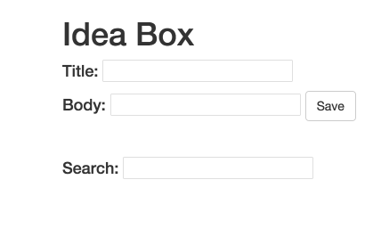

# Ideabox 2.0 Submission Form
[Project Spec](https://github.com/turingschool/curriculum/blob/master/source/projects/revenge_of_idea_box.markdown)

# Basics

### Link to the Github Repository for the Project
[Your Repo](https://github.com/slotaj/idea_box)

### Link to the Deployed Application
[Your Application](http://slota-box.herokuapp.com/)

### Link to Your Commits in the Github Repository for the Project
[Your Commits](https://github.com/slotaj/idea_box/commits/master)

### Provide a Screenshot of your Application

## Completion

### Were you able to complete the base functionality?
* Yes I was

### Which extensions, if any, did you complete?
* I completed inline editing!

### Attach a .gif, or images of any extensions work being used on the site.

# Code Quality

### Link to a specific block of your code on Github that you are proud of
* [Editing](https://github.com/slotaj/idea_box/blob/master/app/assets/javascripts/edit-idea.js)
* I basically got zero help and figured out how to do this myself, so I'm proud of that

### Link to a specific block of your code on Github that you feel not great about
* [up/down](https://github.com/slotaj/idea_box/blob/master/app/assets/javascripts/down-idea.js)
* I honestly was not sure how to refactor and that's probably why I didn't like it

### Attach a screenshot or paste the output from your terminal of the result of your test-suite running.

### Provide a link to an example, if you have one, of a test that covers an 'edge case' or 'unhappy path'

-----

### Please feel free to ask any other questions or make any other statements below!
