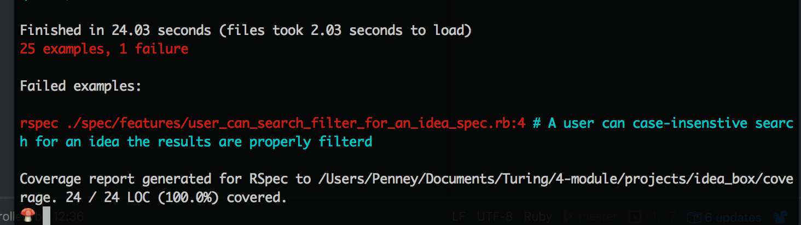

# Ideabox 2.0 Submission Form - Penney Garrett

# Basics

### Link to the Github Repository for the Project
[My Repo](https://github.com/PenneyGadget/idea_box)

### Link to the Deployed Application
[My Application](https://box-of-ideas.herokuapp.com/)

### Link to Your Commits in the Github Repository for the Project
[My Commits](https://github.com/PenneyGadget/idea_box/commits/master)

### Provide a Screenshot of your Application

## Completion

### Were you able to complete the base functionality?

Yes

### Which extensions, if any, did you complete?

I _really_ wanted to do an extension, but ran out of time :(

### Attach a .gif, or images of any extensions work being used on the site.

...

# Code Quality

### Link to a specific block of your code on Github that you are proud of

[Link](https://github.com/PenneyGadget/idea_box/blob/master/app/assets/javascripts/search_filter.js)

I am really proud of this function. It's concise and decently readable. But mostly I'm proud of it because I had to
work for it and I learned a lot in the process. I knew from jumping in the console and adding debuggers that the code worked - and yet... it didn't work. When I called the function in the console the code functioned perfectly and I was beating my head against a wall looking for typos, _anything_, as to why it didn't work in my app. I got some help from a mentor and ended up learning that, basically, because this function finishes faster than any of my AJAX calls, it didn't have any actual data to assign to the <code>$ideas</code> variable within it. So I added the function to the end of the function that grabs all the
ideas and BAM! It works :)

### Link to a specific block of your code on Github that you feel not great about

[Link](https://github.com/PenneyGadget/idea_box/blob/master/app/assets/javascripts/edit_idea.js)

This functions are really long and there's some repeated code. I tried to pull some of the logic out into separate functions,
but when I did that things would break. I'm pretty sure it was because of scoping issues, but I ran out of time to play
around with it more. At this point in the game there's obviously a LOT that I don't know about how to refactor javascript.
I really wish I'd had one more day on this project.

### Attach a screenshot or paste the output from your terminal of the result of your test-suite running.

I have one failing test and can't figure out why. This test wasn't failing initially and then last night all of a sudden it stopped working. The Capybara/Selenium is not filling in the search-filter box, so when I go to assert that certain information is no longer on the page, it is in fact still there. This feature works in production just fine and I'm targeting the text field the same way I am everywhere else in my app.

### Provide a link to an example, if you have one, of a test that covers an 'edge case' or 'unhappy path'

[User cannot create a new idea without both a title and body ](https://github.com/PenneyGadget/idea_box/blob/master/spec/models/idea_spec.rb#L16-L29)
