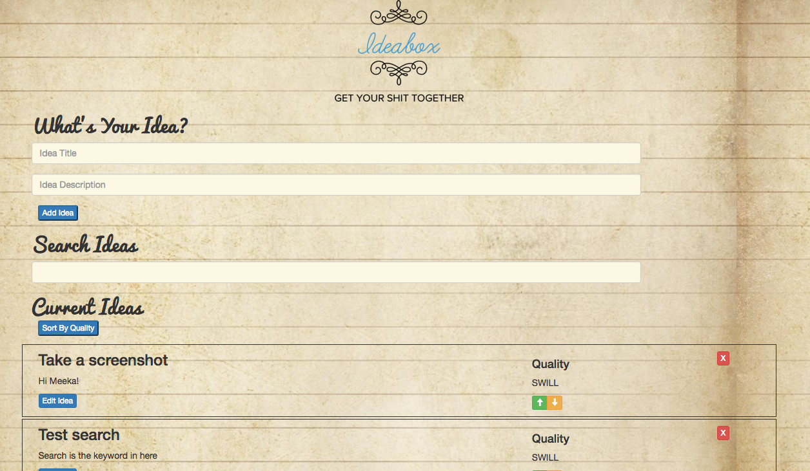
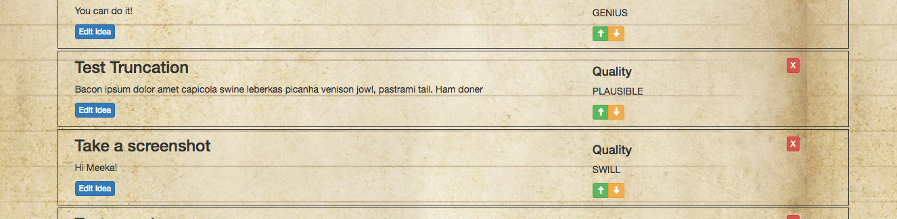
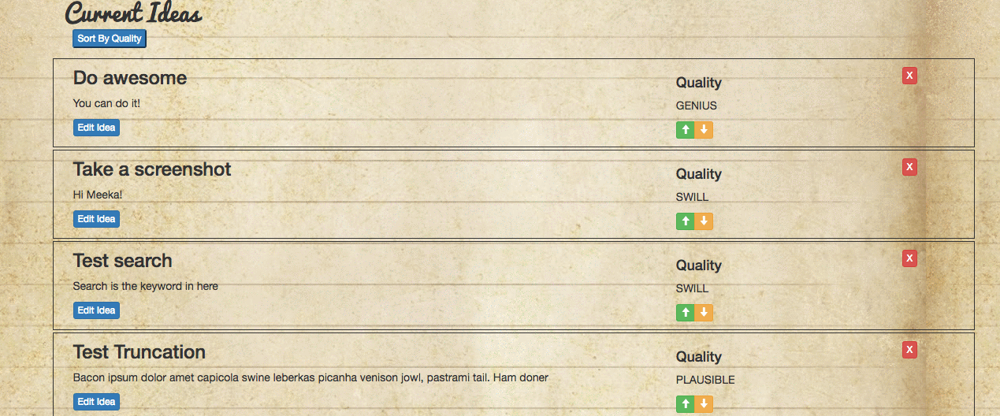

# Ideabox 2.0 Submission Form
[Project Spec](https://github.com/turingschool/curriculum/blob/master/source/projects/revenge_of_idea_box.markdown)

# Basics

### Link to the Github Repository for the Project
[My Amazing Repo](https://github.com/ShannonPaige/idea-box)

### Link to the Deployed Application
[My Wonderful Application](https://idea-box-shannon.herokuapp.com/)

### Link to Your Commits in the Github Repository for the Project
[My Awesome Commits](https://github.com/ShannonPaige/idea-box/commits/master)

### Provide a Screenshot of your Application

## Completion

### Were you able to complete the base functionality?
* Yep

### Which extensions, if any, did you complete?
* Inline idea editing
* Sorting

### Attach a .gif, or images of any extensions work being used on the site.
* Inline idea editing:

* Sorting:

# Code Quality

### Link to a specific block of your code on Github that you are proud of
* [Re-usable Code A](https://github.com/ShannonPaige/idea-box/blob/master/app/assets/javascripts/render_or_hide_idea.js#L33)
and [Re-usable Code B](https://github.com/ShannonPaige/idea-box/blob/master/app/assets/javascripts/all_ideas.js#L5): By sending the sort order to my getIdeas method and then clearing the entire div before I render the ideas, I was able to use the same code for default sort and the sort by quality functionality.

### Link to a specific block of your code on Github that you feel not great about
* [DOM Traversal](https://github.com/ShannonPaige/idea-box/blob/master/app/assets/javascripts/search_ideas.js#L6-L7): WTF am I doing here? I couldn't figure out a better way to grab this data.
* [Duplicate Code](https://github.com/ShannonPaige/idea-box/blob/master/app/assets/javascripts/edit_ideas.js#L38-L45): There's a lot of duplication with the makeEditable method above, but they had enough subtle differences that I couldn't seperate them.

### Attach a screenshot or paste the output from your terminal of the result of your test-suite running.

### Provide a link to an example, if you have one, of a test that covers an 'edge case' or 'unhappy path'
* I don't think I had any, since I didn't validate on Title or Body. That's the only part the user had a
choice on.

-----

### Please feel free to ask any other questions or make any other statements below!
* I feel like I set this project up wrong, cause I had such issues traversing the DOM to get data, sending it to an API, and then traversing again to replace the data. It seems like a smell to me that I should have done a better job storing objects in my javascript?

---

# Instructor Feedback

166

### Data Model

(5 points total.)

### User Flows

#### Viewing ideas

(10 points total.)

#### Adding a new idea

(15 points total.)

#### Deleting an existing idea

(15 points total.)

#### Changing the quality of an idea

(15 points total.)

#### Editing an existing idea

(20 points total.)

#### Idea Filtering and Searching

(15 points total.)

### Extensions

#### Inline idea editing

(10 additional points.)

#### Sorting

(10 additional points.)

## Instructor Evaluation Points

### Specification Adherence

* **10 points**: The application consists of one page with all of the major functionality being provided by jQuery. There is no use of `format.js` in Rails. There is no use of unobstrusive JavaScript. There are no front-end frameworks used in the application. No approach was taken that is counter to the spirit of the project and its learning goals. There are no features missing from above that make the application feel incomplete or hard to use.

### User Interface

* **5 points** - The application is pleasant, logical, and easy to use. There no holes in functionality and the application stands on it own to be used by the instructor _without_ guidance from the developer.

### Testing

* **10 points** - Project has a running test suite that exercises the application at multiple levels including JavaScript tests.

### Ruby and Rails Quality

* **8 points** - Developer solves problems with a balance between conciseness and clarity and often extracts logical components. Developer can speak to choices made in the code and knows what every line of code is doing.

### JavaScript Style

* **8 points** - Application is thoughtfully put together with some duplication and no major bugs. Developer can speak to choices made in the code and knows what every line of code is doing.

### Workflow

* **10 points** - The developer effectively uses Git branches and many small, atomic commits that document the evolution of their application.
