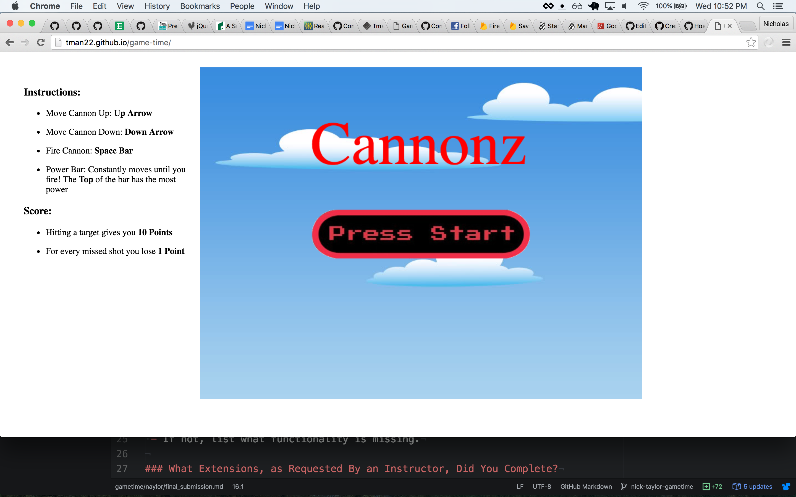

# GameTime Submission Form

## Team Naylor

## Basics

### Link to the Github Repository for the Project

[GameTime](https://github.com/Tman22/game-time)

### Link to the Deployed Application

[Cannonz](http://tman22.github.io/game-time/)

### Link to Your Commits in the Github Repository for the Project

- [tman22](https://github.com/Tman22/game-time/commits?author=tman22)
- [NickyBobby](https://github.com/Tman22/game-time/commits?author=NickyBobby)

### Provide a Screenshot of your Game

- 
- 
- 

---

## Completion

### Do You Consider the Application to be Fully Playable?
 - Yes. We fixed all bugs around collision detection. We have a definite beginning and end. Also, the game gets increasingly difficult as it goes on.

### What Extensions, as Requested By an Instructor, Did You Complete?
- Per Extension:
  - We were given a stretch goal of having a third level. We added the third level and made it super difficult to complete. All targets move.
  - 

### What Features, if Any, Do You Feel Exceed Instructor Expectations?
- Per Feature:
 - Not sure if anything exceeds instructor expectations

----

## Risk Taking
- The risks that we took on this project were mainly getting the trajectory of the cannon ball to look realistic and mimic gravity.
- We feel the risk was well worth it. It took us a long time in the beginning to figure that out, but we did it. We then tinkered with it til it was just right.

----

## Code Quality

### Link to a specific block of your code on Github that you are proud of
- Why were you proud of this piece of code?
- [super clean index.js](https://github.com/Tman22/game-time/blob/master/lib/index.js#L1-38)

### Link to a specific block of your code on Github that you feel not great about
- Nothing really comes to mind, but I'm sure you will tell us what's wrong. Mainly we're just a little bummed that we couldn't get the high score board implemented but we'll do it in the next few days just for funzies.

### Attach a screenshot or paste the output from your terminal of the result of your test-suite running.

### Test Breakdown
- 55 Unit tests
- 

### Provide a link to an example, if you have one, of a unit test that covers an 'edge case' or 'unhappy path'
- [Crucial Unhappy Paths](https://github.com/Tman22/game-time/blob/master/test/collision_test.js#L10-38)
- These tests were crucial for figuring out what was wrong with our collision detection woes.

### Provide a link to an example, if you have one, of a feature test that covers an 'edge case' or 'unhappy path'

-----

### Please feel free to ask any other questions or make any other statements below!

-----

## Instructor Feedback

- Points: (base 300)
