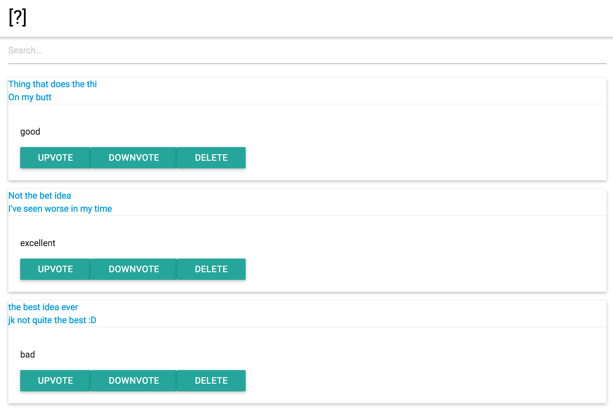

# Ideabox 2.0 Submission Form
[Project Spec](https://github.com/turingschool/curriculum/blob/master/source/projects/revenge_of_idea_box.markdown)

# Basics

[Repository](https://github.com/amaxwellblair/idea_box)

[Deployed Application](https://glacial-river-31267.herokuapp.com/)

[Commit History](https://github.com/amaxwellblair/idea_box/commits/master)

## Completion

### Were you able to complete the base functionality?
* All but body truncation

### Which extensions, if any, did you complete?
* None

# Code Quality

### Link to a specific block of your code on Github that you are proud of
* Not particularly proud of code quality. I used a majority of pure javascript versus jQuery which made me happy.
* Also tried to have restful-ish requests of ideas
  * [See create and update idea](https://github.com/amaxwellblair/idea_box/blob/master/app/assets/javascripts/dashboardIndex.js#L45)

### Link to a specific block of your code on Github that you feel not great about
* Most of the code isn't fantastic. Felt poorly about it due to the lack of organization and DRY fundamentals
* I would have liked to refactor this project by pulling out html generators, ajax calls, and other items to specific directories
  * [Not DRY](https://github.com/amaxwellblair/idea_box/blob/master/app/assets/javascripts/dashboardIndex.js#L77)
  * [Could be moved to separate file](https://github.com/amaxwellblair/idea_box/blob/master/app/assets/javascripts/dashboardIndex.js#L181)
