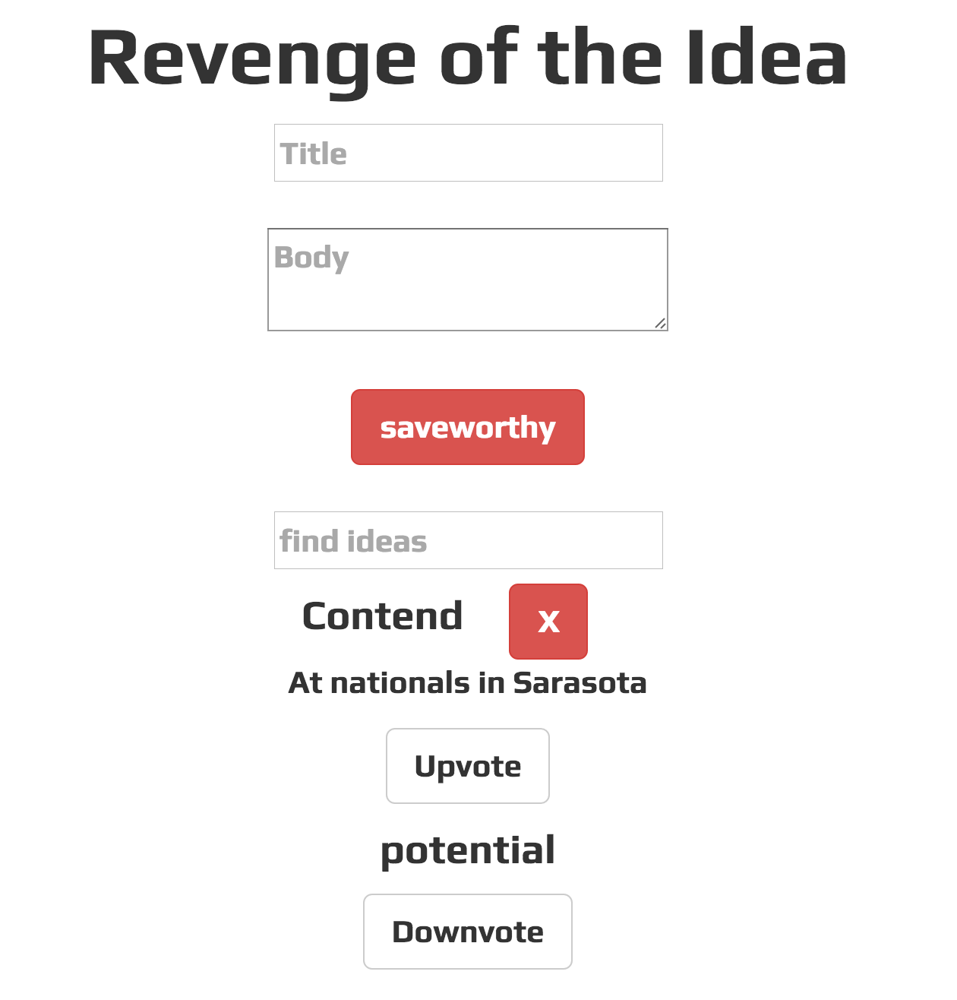

### Link to the Github Repository for the Project
[My Repo](https://github.com/brianrip/idea_box)

### Link to the Deployed Application
[My Application](https://evening-ocean-31041.herokuapp.com/)

### Link to My Commits in the Github Repository for the Project
[My Commits](https://github.com/brianrip/idea_box/commits/master)

### Provide a Screenshot of your Application

## Completion

### Were you able to complete the base functionality?
* Yes, I had a bug last minute with my ideas populating but on than that all base functionality that I know of.

# Code Quality

### Link to a specific block of your code on Github that you are proud of
[edit idea code](http://beesbeesbees.com/)

* I felt like I was able widdle these function down to maintain functionality an easily readable and flexible implementation.

### Link to a specific block of your code on Github that you feel not great about
[lots of conditions code](https://github.com/brianrip/idea_box/blob/master/app/assets/javascripts/adjust_quality.js)

* I feel like there is better way to react to favoriting rather than having 6 conditional if/else statements.

### Attach a screenshot or paste the output from your terminal of the result of your test-suite running.

### Provide a link to an example, if you have one, of a test that covers an 'edge case' or 'unhappy path'
[unhappy](https://github.com/brianrip/idea_box/blob/master/spec/features/user_can_change_quality_of_idea_spec.rb)
-----

### Please feel free to ask any other questions or make any other statements below!
