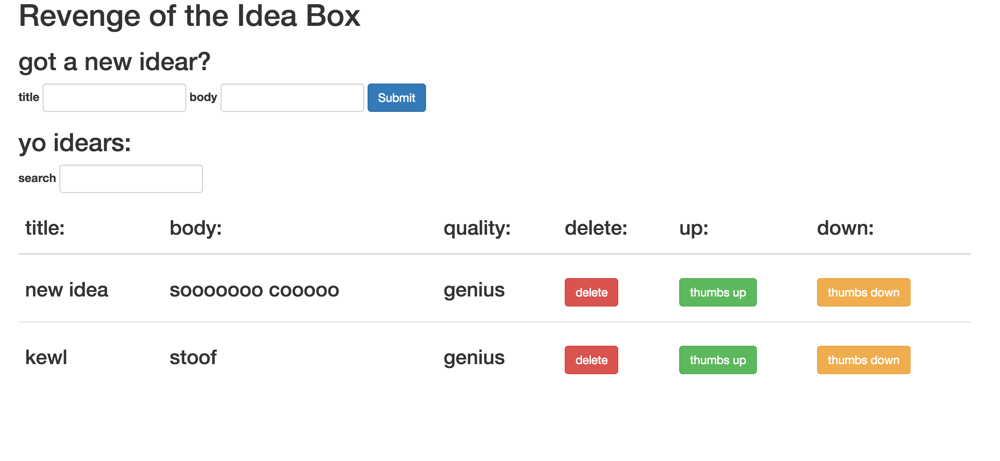

# Basics

### Link to the Github Repository for the Project
[Your Repo](https://github.com/damwhit/revenge_of_idea_box)

### Link to the Deployed Application
[Your Application](http://whittyidea.herokuapp.com/)

### Link to My Commits in the Github Repository for the Project
[Your Commits](https://github.com/damwhit/revenge_of_idea_box/commits/master)

### Provide a Screenshot of your Application

## Completion

### Were you able to complete the base functionality?
* Truncation is missing.

### Which extensions, if any, did you complete?

### Attach a .gif, or images of any extensions work being used on the site.

# Code Quality

### Link to a specific block of your code on Github that you are proud of
  
  I am proud of [this](https://github.com/damwhit/revenge_of_idea_box/blob/master/app/assets/javascripts/updateQuality.js#L4-L37)...
  
  because it enabled me to get rid of
  
  [this](https://github.com/damwhit/revenge_of_idea_box/blob/vote/app/assets/javascripts/updateQuality.js#L20-L21)
  
  and [this](https://github.com/damwhit/revenge_of_idea_box/blob/vote/app/controllers/api/v1/ideas_controller.rb#L16-L24)...
  
  and [this](https://github.com/damwhit/revenge_of_idea_box/blob/vote/app/models/idea.rb#L5-L30)...
  
* Why were you proud of this piece of code?

  I am proud of this code because I was able to eliminate a ton of server side logic(and code) by simply dealing with the quality text rendering prior to making the ajax request to change the idea quality.  I know that it is very poorly refactored and not dry but I finished it at around noon today and wanted to get this submission form done before 1pm today.

### Link to a specific block of your code on Github that you feel not great about
* I still don't feel so great writing the jerverscerps.... 
*  definitely need a lot more practice.  I could probably link to any of them but there are three files where I use very similar code and it is the table text that renders the data.  
*  [here](https://github.com/damwhit/revenge_of_idea_box/blob/master/app/assets/javascripts/getIdeas.js)
*  [here](https://github.com/damwhit/revenge_of_idea_box/blob/master/app/assets/javascripts/addIdea.js)
*  [here](https://github.com/damwhit/revenge_of_idea_box/blob/master/app/assets/javascripts/ideaSearch.js)
*  I feel like there has to be a better way to do this.

### Attach a screenshot or paste the output from your terminal of the result of your test-suite running.

rspec
..........

Finished in 7.12 seconds (files took 2.9 seconds to load)
10 examples, 0 failures

Coverage report generated for RSpec to /Users/davidwhitaker/turing/4module/projects/revenge_of_idea_box/coverage. 30 / 30 LOC (100.0%) covered.

### Provide a link to an example, if you have one, of a test that covers an 'edge case' or 'unhappy path'

This tests against the edge case of someone trying to add a quality other than 'swill', 'plausible', or 'genius':
[test](https://github.com/damwhit/revenge_of_idea_box/blob/master/spec/models/idea_spec.rb#L3-L7)

This test is also quite thorough:
[test](https://github.com/damwhit/revenge_of_idea_box/blob/master/spec/integration/user_can_change_idea_quality_spec.rb)

### Please feel free to ask any other questions or make any other statements below!

I started this project at around 3pm on Tuesday of this week because I did a code challenge for a company Monday evening and Tuesday afternoon.  Given the limited amount of time that I had, I am pretty pleased with how it turned out.
