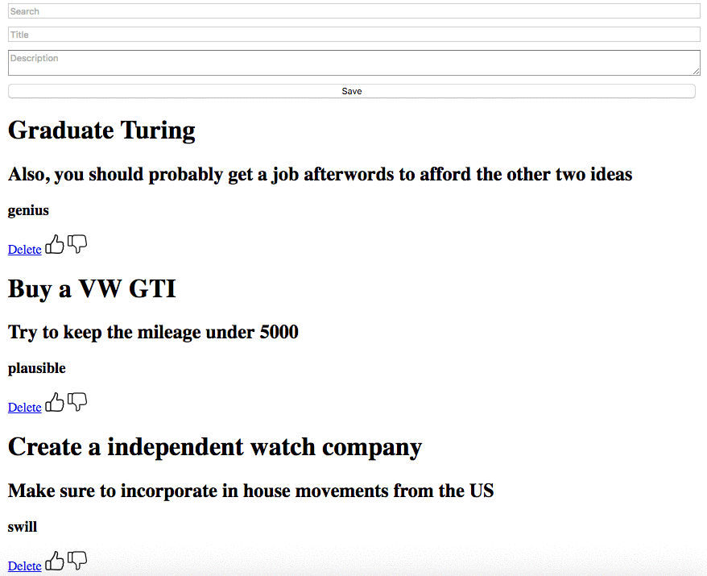
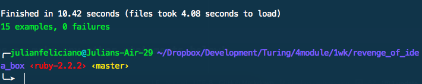
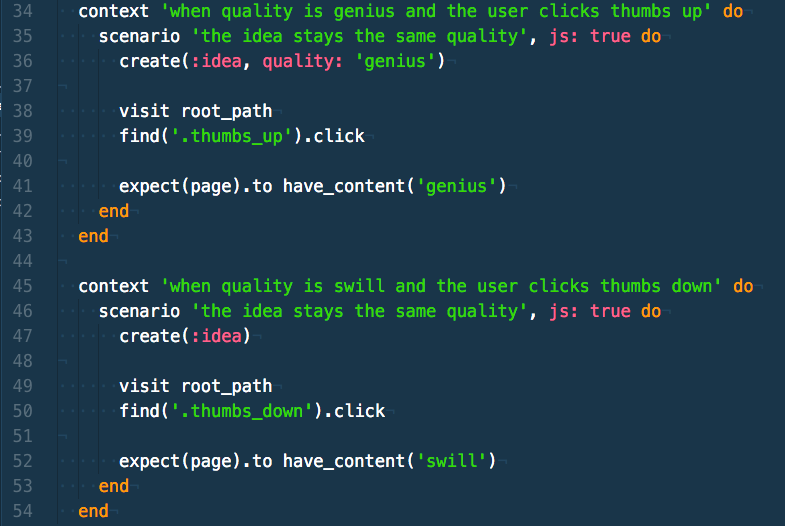

# Basics

### Link to the Github Repository for the Project
[Your Repo](https://github.com/julsfelic/revenge_of_idea_box)

### Link to the Deployed Application
[Your Application](https://floating-taiga-96250.herokuapp.com/)

### Link to Your Commits in the Github Repository for the Project
[Your Commits](https://github.com/julsfelic/revenge_of_idea_box/commits/master)

### Provide a Screenshot of your Application

## Completion

### Were you able to complete the base functionality?
* Did not get to idea body truncation

### Which extensions, if any, did you complete?
* Idea searching, I implemented a fuzzy search that uses an algorithm instead
of a straight letter for letter search similar to Atom's fuzzy searching. This
allows for a better searching experience that most users are used to.

# Code Quality

### Link to a specific block of your code on Github that you are proud of
[Idea JavaScript Class](https://github.com/julsfelic/revenge_of_idea_box/blob/66467decb241e4d0a8dff5376050a56c3a6dc7b3/app/assets/javascripts/idea.js.es6#L1-L65)

* Without knowing it, I was able to semi-recreate the idea of an Idea model on the
front-end. This snippet also includes ES6 which was the main focus of this project
for myself. Now that I have gone through this project once, I can see how we could
apply different patterns (like MVC) to the front-end JS as well to have a cohesive set of
code that relates from front to back.

### Link to a specific block of your code on Github that you feel not great about
[Using erb with JS...Yuck](https://github.com/julsfelic/revenge_of_idea_box/blob/66467decb241e4d0a8dff5376050a56c3a6dc7b3/app/assets/javascripts/main.js.es6.erb#L4-L5)

* I had the hardest time using my image files with dynamically created ideas because
of the asset pipeline fingerprinting the images. The only work around was adding the
`.erb` extension to the JS file and using the `asset_path` helper to grab the image. Something
about the code just seems not clean to me and I really despise the asset pipeline
at the moment.

### Attach a screenshot or paste the output from your terminal of the result of your test-suite running.

### Provide a link to an example, if you have one, of a test that covers an 'edge case' or 'unhappy path'

-----

### Please feel free to ask any other questions or make any other statements below!

My main focus for this project was to try incorporating ES6 and a module loader,
browserify in this case, into a Rails project. I kept styling to a super minimum so
that I could focus all my energy towards the JS portion of the project. Unfortunately,
I could not get teaspoon to play nice with browserify and couldn't get the unit test
working. I left a unit test that is pending up for an example, but working with newer JS
features and the Asset Pipeline proved to be a big challenge.

# Instructor Feedback

155/150

### Data Model

(5 points total.)

### User Flows

#### Viewing ideas

(5 points total.)

Missing Truncation

#### Adding a new idea

(15 points total.)

#### Deleting an existing idea

(15 points total.)

#### Changing the quality of an idea

(15 points total.)

#### Editing an existing idea

(20 points total.)

#### Idea Filtering and Searching

(15 points total.)

### Extensions

#### Student Directed Extension

(10 additional points.)

Fuzzy Search!

Student chooses an additional feature or performance optimization to add to the project. The extension must be intuitive and should not detract from the user's experience in any major way (i.e. not buggy or incomplete).

## Instructor Evaluation Points

### Specification Adherence

* **10 points**

### User Interface

* **5 points** - The application is pleasant, logical, and easy to use. There no holes in functionality and the application stands on it own to be used by the instructor _without_ guidance from the developer.

### Testing

* **10 points** - Project has a running test suite that exercises the application at multiple levels including JavaScript tests.

### Ruby and Rails Quality

* **10 points** - Developer is able to craft Rails features that make smart use of Ruby, follow the principles of MVC, and push business logic down where it belongs. There _zero_ instances where an instructor would recommend taking a different approach. Developer writes code that is exceptionally clear and well-factored. Application is expertly divided into logical components each with a clear, single responsibility.

### JavaScript Style

* **10 points** - Application has exceptionally well-factored code with little or no duplication and all components separated out into logical components. There _zero_ instances where an instructor would recommend taking a different approach.

### Workflow

* **10 points** - The developer effectively uses Git branches and many small, atomic commits that document the evolution of their application.
