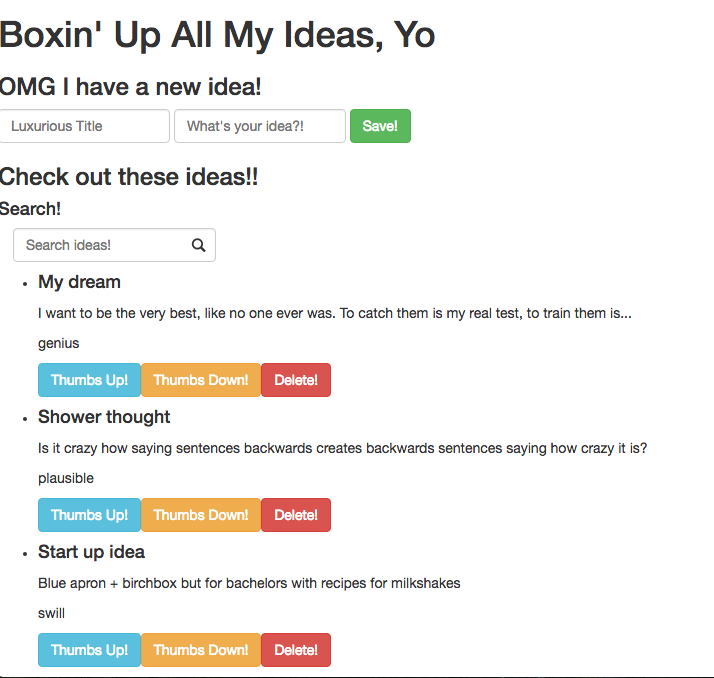

# Ideabox 2.0 Submission Form
[Project Spec](https://github.com/turingschool/curriculum/blob/master/source/projects/revenge_of_idea_box.markdown)

# Basics

### Link to the Github Repository for the Project
[My Repo](https://github.com/julyytran/ideabox)

### Link to the Deployed Application
[Boxin' Up All My Ideas, Yo](http://boxing-up-all-my-ideas.herokuapp.com/)

### Link to Your Commits in the Github Repository for the Project
[My Commits](https://github.com/julyytran/ideabox/commits/master)

### Provide a Screenshot of your Application

## Completion

### Were you able to complete the base functionality?
* If not, list what functionality is missing.
* Yes 

### Which extensions, if any, did you complete?

### Attach a .gif, or images of any extensions work being used on the site.

# Code Quality

### Link to a specific block of your code on Github that you are proud of
* Why were you proud of this piece of code?
* [Quality changing](https://github.com/julyytran/ideabox/blob/master/app/assets/javascripts/change-quality.js#L10-L20) is clean and utilizes objects instead of if/elses. 

### Link to a specific block of your code on Github that you feel not great about
* Why do you feel not awesome about the code? What challenges did you face trying to write/refactor it?
* [The edit test](https://github.com/julyytran/ideabox/blob/master/spec/features/user_can_edit_an_idea_spec.rb#L27-L31) has to have the click and send_keys twice or else it doesn't work. Not sure why. Not happy about it. 

### Attach a screenshot or paste the output from your terminal of the result of your test-suite running.
Finished in 8.5 seconds (files took 2.27 seconds to load)
18 examples, 0 failures

Coverage report generated for RSpec to /Users/July/turing/4module/projects/ideabox/coverage. 204 / 204 LOC (100.0%) covered.

### Provide a link to an example, if you have one, of a test that covers an 'edge case' or 'unhappy path'
[Test that 'genius' doesn't change if upvoted](https://github.com/julyytran/ideabox/blob/master/spec/features/user_can_change_quality_spec.rb#L75-L92)

-----

### Please feel free to ask any other questions or make any other statements below!

# Instructor Feedback

144/150

### Data Model

(5 points total.)

### User Flows

#### Viewing ideas

(10 points total.)

#### Adding a new idea

(15 points total.)

#### Deleting an existing idea

(15 points total.)

#### Changing the quality of an idea

(15 points total.)

#### Editing an existing idea

(20 points total.)

#### Idea Filtering and Searching

(15 points total.)

### Instructor Evaluation Points

#### Specification Adherence

10 points: The application consists of one page with all of the major functionality being provided by jQuery. There is no use of format.js in Rails. There is no use of unobstrusive JavaScript. There are no front-end frameworks used in the application. No approach was taken that is counter to the spirit of the project and its learning goals. There are no features missing from above that make the application feel incomplete or hard to use.

#### User Interface

5 points - The application is pleasant, logical, and easy to use. There no holes in functionality and the application stands on it own to be used by the instructor without guidance from the developer.

#### Testing

8 points - Project has a running test suite that tests and multiple levels but fails to cover some features. All controller actions are covered by tests. The application makes some use of integration testing.

#### Ruby and Rails Quality

8 points - Developer solves problems with a balance between conciseness and clarity and often extracts logical components. Developer can speak to choices made in the code and knows what every line of code is doing.

####mJavaScript Style

8 points - Application is thoughtfully put together with some duplication and no major bugs. Developer can speak to choices made in the code and knows what every line of code is doing.

#### Workflow

10 points - The developer effectively uses Git branches and many small, atomic commits that document the evolution of their application.
