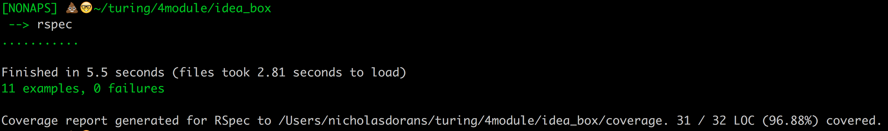

# Ideabox 2.0 Submission Form
[Project Spec](https://github.com/turingschool/curriculum/blob/master/source/projects/revenge_of_idea_box.markdown)

* Fork this repo, if you haven't already and check out a branch
* Use this README as a template to create a file in this folder with your name as the title.
* Submit a pull request
* Pro Tip: You can use [recordit.co](http://recordit.co/) to record interaction gifs.
* Secondary Pro Tip: [Here's how to link to specific line number(s) in Github](http://stackoverflow.com/questions/23821235/how-to-link-to-specific-line-number-on-github)
* Tertiary Pro Tip: You can re-use some of these things in your portfolio/resume

------
# Nicholas Doorantz - Idea Box 2.0

# Basics

### Link to the Github Repository for the Project
[No Naps Repo](https://github.com/NickyBobby/idea_box)

### Link to the Deployed Application
[No Naps Production](http://no-naps-idea-box.herokuapp.com/)

### Link to Your Commits in the Github Repository for the Project
[No Naps Commits](https://github.com/NickyBobby/idea_box/commits/master)

### Provide a Screenshot of your Application


## Completion

### Were you able to complete the base functionality?
* Yes, except truncating the body. I also didn't do the best job with testing my JerbaScrap.

### Which extensions, if any, did you complete?
* none

### Attach a .gif, or images of any extensions work being used on the site.


# Code Quality

### Link to a specific block of your code on Github that you are proud of
* Why were you proud of this piece of code?

### Link to a specific block of your code on Github that you feel not great about
[Repetitious as fugggggggg](https://github.com/NickyBobby/idea_box/blob/master/app/assets/javascripts/ideas.js#L30-L40)

* I was able to refactor it a bit but I was still repeating myself. I originally have two separate functions for thumbs up and thumbs down but I was able to condense that down to one.  

### Attach a screenshot or paste the output from your terminal of the result of your test-suite running.



### Provide a link to an example, if you have one, of a test that covers an 'edge case' or 'unhappy path'
* not proud of my testing

-----

### Please feel free to ask any other questions or make any other statements below!

* I'm embarrassed by how shitty my testing is. I need to work on that. It's always hard for me to test things as I'm learning how the functionality actually works.


# Instructor Feedback

138/150

Don't be embarrassed about testing at this point - most people tend to spike as their learning - it's hard to both test and be like 'what the heck is happening' at the same time and sometimes trying to do that actually wastes more time than it's worth. Just keep building on it as you go!

This is a really solid implementation. 

Ruby/Rails: Good job on using scopes and getting the upvote and downvote to speak to the ideas update endpoint instead of creating new endpoints!

JavaScript: Your ideas.js file is pretty long (around 169 lines) - you should definitely be splitting up files at least by the 150 lines mark. Some places you could split - maybe move your templating into its own file (this code)[https://github.com/NickyBobby/idea_box/blob/master/app/assets/javascripts/ideas.js#L85-L96]

You probably don't need to wrap all of your js code in the document.ready - just the code that you call.

I think you're right in [these methods](https://github.com/NickyBobby/idea_box/blob/master/app/assets/javascripts/ideas.js#L30-L40) being a little repetative. Probably you could do something like: 

```js
  function toggleQuality(direction){
    var quality = $(this).parent().children('p').text();
    var id  = $(this).parent().attr('id');
    thumbsUpOrThumbsDown(id, quality, this, direction);
  }
```

Over all - the javascript is really solid though - and it seems like you have a really good handle on what's going on.

### Data Model

(5 points total.)

### User Flows

#### Viewing ideas

(5 points total.)

(Missing truncation)

#### Adding a new idea

(15 points total.)

#### Deleting an existing idea

(15 points total.)

#### Changing the quality of an idea

(15 points total.)

#### Editing an existing idea

(20 points total.)

#### Idea Filtering and Searching

(15 points total.)

## Instructor Evaluation Points

### Specification Adherence

* **10 points**: The application consists of one page with all of the major functionality being provided by jQuery. There is no use of `format.js` in Rails. There is no use of unobstrusive JavaScript. There are no front-end frameworks used in the application. No approach was taken that is counter to the spirit of the project and its learning goals. There are no features missing from above that make the application feel incomplete or hard to use.

### User Interface

* **5 points** - The application is pleasant, logical, and easy to use. There no holes in functionality and the application stands on it own to be used by the instructor _without_ guidance from the developer.

### Testing

* **5 points** - Project has sporadic use of tests and multiple levels. Not all controller actions are tested. There are little or no attempts at integration testing.

### Ruby and Rails Quality

* **10 points** - Developer is able to craft Rails features that make smart use of Ruby, follow the principles of MVC, and push business logic down where it belongs. There _zero_ instances where an instructor would recommend taking a different approach. Developer writes code that is exceptionally clear and well-factored. Application is expertly divided into logical components each with a clear, single responsibility.

### JavaScript Style

* **8 points** - Application is thoughtfully put together with some duplication and no major bugs. Developer can speak to choices made in the code and knows what every line of code is doing.

### Workflow

* **10 points** - The developer effectively uses Git branches and many small, atomic commits that document the evolution of their application.
