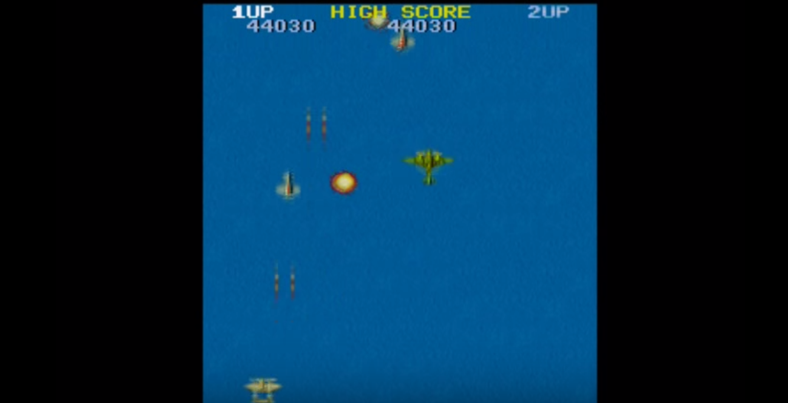

# 1942

[Project Spec](https://github.com/turingschool/lesson_plans/blob/master/ruby_04-apis_and_scalability/gametime_project.markdown)

### Team
- [Ashwin](https://github.com/theonlyrao)
- [Thom](https://github.com/thompickett)

### Link to the Github Repository for the Project
[1942 repo on Github](https://github.com/theonlyrao/1942)

### Link to the Waffle for the Project
[1942 repo on Github](https://waffle.com/theonlyrao/1942)
