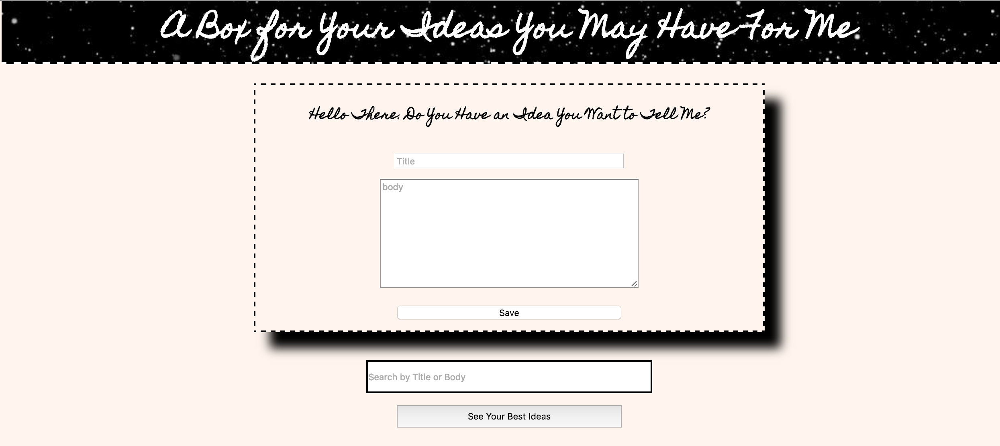

### Link to the Github Repository for the Project
[MyRepo](https://github.com/Jbern16/ideabox)

### Link to the Deployed Application
[Deployed](https://idea-in-a-box.herokuapp.com/)

### Link to Your Commits in the Github Repository for the Project
[My Commits](https://github.com/Jbern16/ideabox/commits/master)

### Provide a Screenshot of your Application

## Completion

### Were you able to complete the base functionality?
Yes.

### Which extensions, if any, did you complete?
Sort and Self-Directed - I implemented a Binary JSON Data Store in postgres to store my ideas data.
This makes querying very fast! It added a few hurdles for some of the Ajax calls and default quality.

### Attach a .gif, or images of any extensions work being used on the site.
[Sort Gif](http://recordit.co/qbEhHUb2RO)
# Code Quality

### Link to a specific block of your code on Github that you are proud of
[Proud Code](https://github.com/Jbern16/ideabox/blob/master/app/assets/javascripts/service_helpers.js.es6#L1-L21)

I like this piece of code because it seperated each part of the idea I append, generically. If selectors change, or I need to add specific attributes
to what is being append, I just have to do it in one place. It was super maintainable throughout the project

### Link to a specific block of your code on Github that you feel not great about
[Not Proud Code](https://github.com/Jbern16/ideabox/blob/master/app/assets/javascripts/service_helpers.js.es6#L22-L35)

Although this piece of code is clever in how it truncates words on the first word break after 100, I like. However, I believe it is a messy 
implementation and in its current state, many parts of it can be extracted out.

### Attach a screenshot or paste the output from your terminal of the result of your test-suite running.

### Provide a link to an example, if you have one, of a test that covers an 'edge case' or 'unhappy path'
[Edge Case](https://github.com/Jbern16/ideabox/blob/master/spec/features/user_can_edit_quality_spec.rb#L24-L43)
-----

### Please feel free to ask any other questions or make any other statements below!