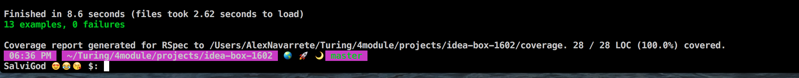

# Ideabox 2.0 Submission Form
[Project Spec](https://github.com/turingschool/curriculum/blob/master/source/projects/revenge_of_idea_box.markdown)

------

# Basics

### Link to the Github Repository for the Project
[My Repo](https://github.com/Salvi6God/idea-box-1602)

### Link to the Deployed Application
[Heroku Site](https://salvi-ideabox.herokuapp.com/)

### Link to Your Commits in the Github Repository for the Project
[My Commits](https://github.com/Salvi6God/idea-box-1602/commits/master)

### Provide a Screenshot of your Application

## Completion

### Were you able to complete the base functionality?
* If not, list what functionality is missing.
  I ended up skipping the truncate body.

### Which extensions, if any, did you complete?
none.

### Attach a .gif, or images of any extensions work being used on the site.

# Code Quality

### Link to a specific block of your code on Github that you are proud of
[code that puts a smile on my face](https://github.com/Salvi6God/idea-box-1602/blob/master/app/assets/javascripts/delete.js)
* Why were you proud of this piece of code?
    - I'm proud of this code because its the most simple one out of all of the main functions being used. I noticed that there is still some gaps for me when it comes to refactoring in JavaScript that'll change as I continue throughout the module.

### Link to a specific block of your code on Github that you feel not great about
[update quality](https://github.com/Salvi6God/idea-box-1602/blob/master/app/assets/javascripts/update_quality.js)
 
[edit feature](https://github.com/Salvi6God/idea-box-1602/blob/master/app/assets/javascripts/edit.js)
* Why do you feel not awesome about the code? What challenges did you face trying to write/refactor it?
  I couldn't figure a way out to make the logic follow the DRY convention. The challenge for me was figuring out a way how to make one function differentiate between the type of code that will be passed into the AJAX call.

### Attach a screenshot or paste the output from your terminal of the result of your test-suite running.

### Provide a link to an example, if you have one, of a test that covers an 'edge case' or 'unhappy path'

[covered edge case](https://github.com/Salvi6God/idea-box-1602/blob/master/spec/features/user_searches_for_idea_spec.rb)

This covers any type of way a user inputs their search terms in the search box.

-----

### Please feel free to ask any other questions or make any other statements below!
