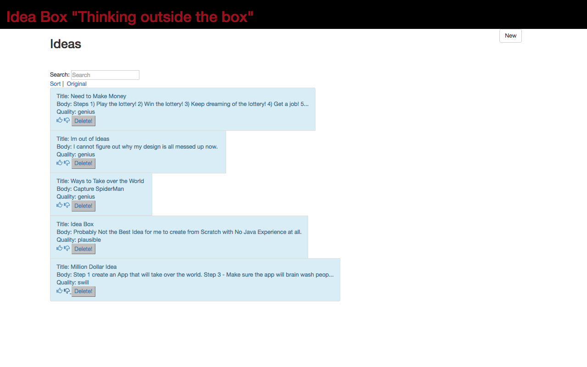

# Ideabox 2.0 Submission Form
[Project Spec](https://github.com/turingschool/curriculum/blob/master/source/projects/revenge_of_idea_box.markdown)

* Fork this repo, if you haven't already and check out a branch
* Use this README as a template to create a file in this folder with your name as the title.
* Submit a pull request
* Pro Tip: You can use [recordit.co](http://recordit.co/) to record interaction gifs.
* Secondary Pro Tip: [Here's how to link to specific line number(s) in Github](http://stackoverflow.com/questions/23821235/how-to-link-to-specific-line-number-on-github)
* Tertiary Pro Tip: You can re-use some of these things in your portfolio/resume

------

# Basics

### Link to the Github Repository for the Project
[Your Repo](https://github.com/alirezaandersen/idea_box.git)

### Link to the Deployed Application
[Your Application](https://vast-brushlands-41903.herokuapp.com/#)

### Link to Your Commits in the Github Repository for the Project
[Your Commits](https://github.com/alirezaandersen/idea_box/commits/master)

### Provide a Screenshot of your Application

## Completion

### Were you able to complete the base functionality?
* Yes, finished them all!!!

### Which extensions, if any, did you complete?
Sort but it's broken now..... And I don't know why!

### Attach a .gif, or images of any extensions work being used on the site.

# Code Quality

### Link to a specific block of your code on Github that you are proud of
* Why were you proud of this piece of code?
https://github.com/alirezaandersen/idea_box/blob/master/app/assets/javascripts/index.js#L101-L122
I think all of my JavaScript I am proud of. I did this project originally with mostly ajax and jquery calls but last night decided to try to do it in JavaScript. This particular section is the search, The reason I am most proud of it is I have never done a search filter like this and am proud that it works.

### Link to a specific block of your code on Github that you feel not great about
* Why do you feel not awesome about the code? What challenges did you face trying to write/refactor it?
All of my JavaScript. My issue was I didn't break it up into multiple files and have been having major difficulties when I tried to break it up.
### Attach a screenshot or paste the output from your terminal of the result of your test-suite running.

Finished in 0.10213 seconds (files took 2.41 seconds to load)
10 examples, 0 failures, 4 pending

### Provide a link to an example, if you have one, of a test that covers an 'edge case' or 'unhappy path'
current all of feature test are unhappy and Broken :-( when I changed all of my calls to JS everything stop working
https://github.com/alirezaandersen/idea_box/tree/master/spec
-----

### Please feel free to ask any other questions or make any other statements below!
  testing has been a huge challenge. I feel its my own fault for not focusing more on the testing example that was provided.
