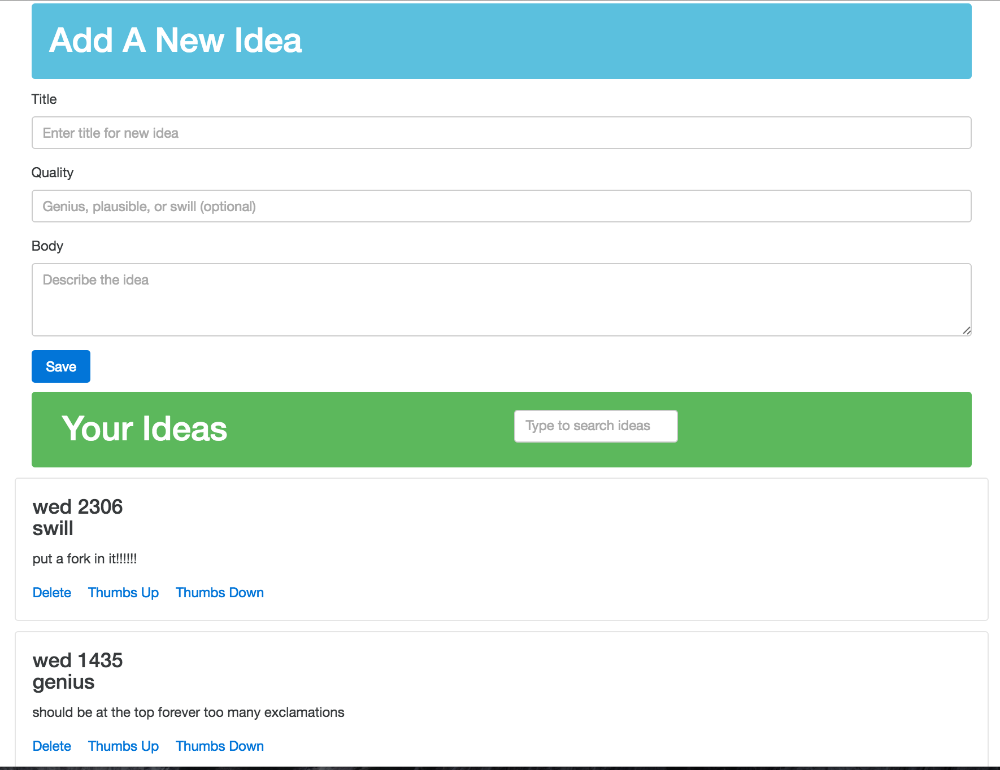

# Ideabox 2.0 Submission Form
[Project Spec](https://github.com/turingschool/curriculum/blob/master/source/projects/revenge_of_idea_box.markdown)

* Fork this repo, if you haven't already and check out a branch
* Use this README as a template to create a file in this folder with your name as the title.
* Submit a pull request
* Pro Tip: You can use [recordit.co](http://recordit.co/) to record interaction gifs.
* Secondary Pro Tip: [Here's how to link to specific line number(s) in Github](http://stackoverflow.com/questions/23821235/how-to-link-to-specific-line-number-on-github)
* Tertiary Pro Tip: You can re-use some of these things in your portfolio/resume

------

# Basics

### Link to the Github Repository for the Project
[Your Repo](https://github.com/theonlyrao/idea_box)

### Link to the Deployed Application
[Your Application](https://aqueous-inlet-88354.herokuapp.com/)

### Link to Your Commits in the Github Repository for the Project
[Your Commits](https://github.com/theonlyrao/idea_box/commits/master)

### Provide a Screenshot of your Application

## Completion

### Were you able to complete the base functionality?
I think the answer is yes. I did not complete the truncation feature.

### Which extensions, if any, did you complete?
None

### Attach a .gif, or images of any extensions work being used on the site.
NA

# Code Quality

### Link to a specific block of your code on Github that you are proud of
[Search function](https://github.com/theonlyrao/idea_box/blob/3a1a1591989e88e9f0f1c25df6b3da48ac2d82bf/app/assets/javascripts/search_ideas.js#L7-L16)

I am proud of this piece of code because it uses what I think is exactly the right jQuery method to do the search feature. Instead of having to create collections and then iterate through them, by using contains the code here is extremely simple.

### Link to a specific block of your code on Github that you feel not great about
* Why do you feel not awesome about the code? What challenges did you face trying to write/refactor it?
[Change quality function](https://github.com/theonlyrao/idea_box/blob/3a1a1591989e88e9f0f1c25df6b3da48ac2d82bf/app/assets/javascripts/change_quality.js#L1-L29)

This is bad code because there is repetition in several places - the assignment of variables and the ajax call. Each of these functions also violates SRP because it is responsible for listening, gathering the data, and sending the ajax request. 

A lack of time was one issue with refactoring this. However, one of the reasons I didn't have enough time was that I'm still not very comfortable with how exactly to nest functions in JS.

### Attach a screenshot or paste the output from your terminal of the result of your test-suite running.

### Provide a link to an example, if you have one, of a test that covers an 'edge case' or 'unhappy path'
[Create idea with capitalized quality](https://github.com/theonlyrao/idea_box/blob/3a1a1591989e88e9f0f1c25df6b3da48ac2d82bf/spec/features/guest_can_create_ideas_spec.rb#L24-L43)

-----

### Please feel free to ask any other questions or make any other statements below!
I learned a lot in this project. It was a hard project because I hadn't really used jQuery much in mod 3 but I was able to trust that I'd get things figured out and I mostly did. I also wasn't expecting to like client-side work but it's actually pretty cool to be able to build functionality that provides the UX I'd want in an app. It was also very enjoyable to be working on the point system instead of the 1/2/3/4 scale.

### PROJECT EVALUTATION
### Data Model
(5 points total.)
### User Flows
#### Viewing ideas
(5 Points) - missing truncation
#### Adding a new idea
(15 points total.)
#### Deleting an existing idea
(15 points total.)
#### Changing the quality of an idea
(15 points total.)
#### Editing an existing idea
(20 points total.)
#### Idea Filtering and Searching
(15 points total.)
## Instructor Evaluation Points
### Specification Adherence
10 points    
### User Interface  
5 points - The application is pleasant, logical, and easy to use. There no holes in functionality and the application stands on it own to be used by the instructor _without_ guidance from the developer.
### Testing
10 points  - Project has a running test suite that exercises the application at multiple levels including JavaScript tests.
### Ruby and Rails Quality
10 points 
### JavaScript Style
8 points - Application is thoughtfully put together with some duplication and no major bugs. Developer can speak to choices made in the code and knows what every line of code is doing.
### Workflow
10 points - The developer effectively uses Git branches and many small, atomic commits that document the evolution of their application.

### Final Score: 143/150
