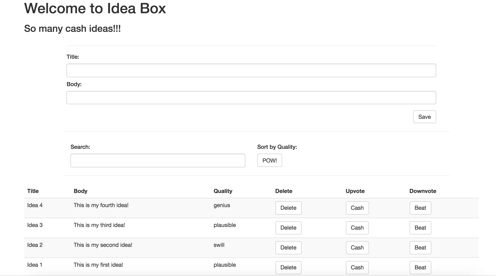
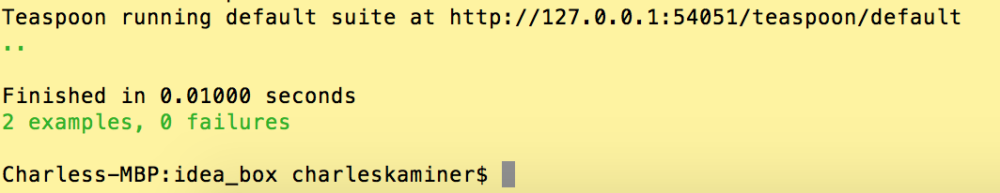

# Ideabox 2.0 Submission Form - Charlie Kaminer
[Project Spec](https://github.com/turingschool/curriculum/blob/master/source/projects/revenge_of_idea_box.markdown)

------

# Basics

### Link to the Github Repository for the Project
[Your Repo](https://github.com/ckaminer/idea_box)

### Link to the Deployed Application
[Your Application](http://guarded-brook-71177.herokuapp.com/)

### Link to Your Commits in the Github Repository for the Project
[Your Commits](https://github.com/ckaminer/idea_box/commits/master)

### Provide a Screenshot of your Application

## Completion

### Were you able to complete the base functionality?
* Aside from the truncation feature (in production), yes.

### Which extensions, if any, did you complete?
* I completed the quality sort extension.

### Attach a .gif, or images of any extensions work being used on the site.

# Code Quality

### Link to a specific block of your code on Github that you are proud of
* Why were you proud of this piece of code?

 [Create Idea Event](https://github.com/ckaminer/idea_box/blob/d7d065b1c6fc2f55126025d0ce3e2b0a0758abef/app/assets/javascripts/create_and_load.js#L32-L50)

 I'm proud of this piece of code because it not only deals with idea creation in a relatively clean way but also touches on UX.  I was having problems with blank boxes getting added to the table despite not making it through a successful ajax request.  I like the fact that a user will receive an explicit alert message without leaving the page.

### Link to a specific block of your code on Github that you feel not great about
* Why do you feel not awesome about the code? What challenges did you face trying to write/refactor it?

 [Upvote Downvote](https://github.com/ckaminer/idea_box/blob/d7d065b1c6fc2f55126025d0ce3e2b0a0758abef/app/assets/javascripts/quality_vote.js#L17-L37)

 I don't feel awesome about this code for a few reasons.  For one, it would have been more beneficial to not use an enum here (here meaning this entire project).  This code is an example of its downsides as I am forced to make multiple references to the quality array which is not ideal.  Additionally, this can very clearly be re-factored as almost the entire method is the same for up and down votes.  Ideally, I'd like to implement some kind of "direction" logic similar to how I did in the quality sort methods.

### Attach a screenshot or paste the output from your terminal of the result of your test-suite running.

### Provide a link to an example, if you have one, of a test that covers an 'edge case' or 'unhappy path'
*
 [Search Filter Feature Spec](https://github.com/ckaminer/idea_box/blob/d7d065b1c6fc2f55126025d0ce3e2b0a0758abef/spec/features/search_filter_spec.rb#L17-L38)
-----

### Please feel free to ask any other questions or make any other statements below!
