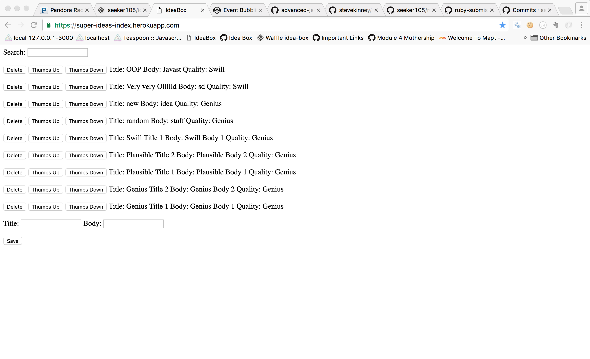

# Basics

### Link to the Github Repository for the Project
[My GitHub](https://github.com/seeker105/idea_box)

### Link to the Deployed Application
[My Application](https://super-ideas-index.herokuapp.com/)

### Link to Your Commits in the Github Repository for the Project
[My Commits](https://github.com/seeker105/idea_box/commits/master)

### Provide a Screenshot of your Application

## Completion

### Were you able to complete the base functionality?
Missing 100 character truncation

### Which extensions, if any, did you complete?

### Attach a .gif, or images of any extensions work being used on the site.

# Code Quality

### Link to a specific block of your code on Github that you are proud of
[GitHub](https://github.com/seeker105/idea_box/blob/master/app/assets/javascripts/ideas.js#L124-L129)
This required exploring new JavaScript functionality that I was completely unfamiliar with. I used the debugger to check return values and function results. I had to experiment with triggering `focusout` and `blur` to see which produced the result I needed.

### Link to a specific block of your code on Github that you feel not great about
[GitHub](https://github.com/seeker105/idea_box/blob/master/app/assets/javascripts/ideas.js#L62-L87)
Waaay too much repetition.

### Attach a screenshot or paste the output from your terminal of the result of your test-suite running.

### Provide a link to an example, if you have one, of a test that covers an 'edge case' or 'unhappy path'
