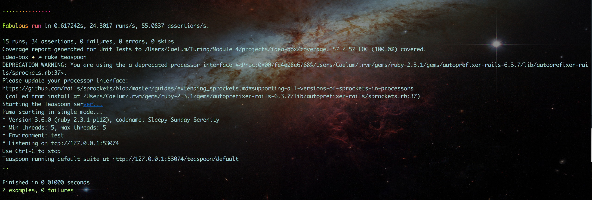

## Parker Phillips, Idea Box

### Important Links:

[Github Repo](https://github.com/ExCaelum/idea-box)

[Production Link](https://floating-cliffs-42121.herokuapp.com/)

[Github Commits](https://github.com/ExCaelum/idea-box/commits/master)

### Screenshot:

### Completion:
##### Were you able to complete the base functionality?
I was able to complete the basic functionality

##### Which extensions, if any, did you complete?
I did not complete any extensions

### Code Quality:
##### Link to a specific block of code on Github that you are proud of
 [Building Ideas on document.ready](https://github.com/ExCaelum/idea-box/blob/master/app/assets/javascripts/build_ideas.js)

##### Why were you proud of this piece of code?
I am proud of this code because this is the first piece of JS that I have written that I understand. I feel like it definitely could be better, but I am proud of the way it turned out and the way it functions for it being my first piece of JavaScript code.

##### Link to a specific block of your code on Github that you feel not great about
[Voting](https://github.com/ExCaelum/idea-box/blob/master/app/assets/javascripts/voting.js)

##### Why do you feel not awesome about the code? What challenges did you face trying to write/refactor it?
I was really struggling with keeping the logic in JS. I had issues making the JS communicate with the enum quality for ideas. I was forced to move the logic of updating into the idea model itself, and I would have liked to figure out how to do it in JavaScript.

##### Attach a screenshot or past the output from your terminal of the result of your test-suite running.

##### Provide a link to an example, if you have one, of a test that covers an 'edge case' or 'unhappy path'
[Github Link - Sad Path Test - Error on create with no/invalid data](https://github.com/ExCaelum/idea-box/blob/master/test/controllers/api/v1/ideas_controller_test.rb)
