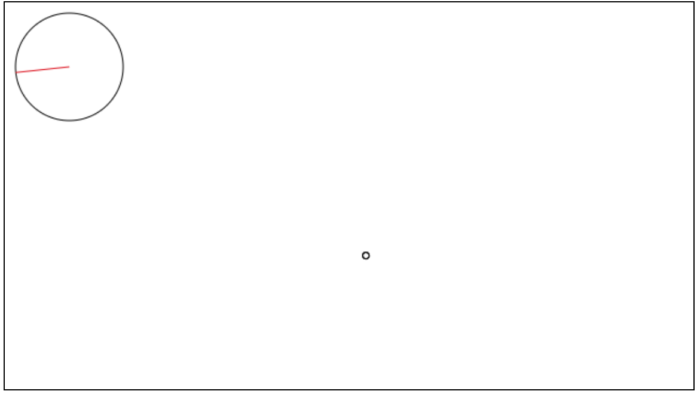

# Game Time Check In # 1

## Basics

### Team
- [Trent](https://github.com/twhitinger)
- [Chris](https://github.com/concach)

### Game Name

Lyger Woods 2017

### Give a Basic Description of the Game

MiniGolf where every hit could lead to catastrophic outcomes

### Include a Link to or Screen Shot of the Game

### Link to the Github repository for the project
[Your Repo](https://github.com/concach/game-time)

## The Plan

### Describe Your goals for the finished product

e.g.

- User can choose direction to hit the ball
- User can choose the power to hit the ball with
- Various obstacales can obstruct the path of the ball
- Terrain type can impact the velocity of the ball
- If certain conditions are met the ball can blow things up
- Multiple rounds where difficulty increases and impacts resistance on the ball
- User uses spacebar when instructed to control the ball hit

### What is your MVP, or 'this was harder than I thought' plan?

e.g.

- User can choose direction to hit the ball
- User can choose the power to hit the ball with
- User uses spacebar when instructed to control the ball hit
- Various obstacales can obstruct the path of the ball
- Terrain type can impact the velocity of the ball
- Ball in the hole - 9 rounds

### What have you accomplished so far?
created a canvas, created a directional meter, created a move function on the ball

### Questions, Comments, Concerns?
- deploying to github pages
- organization of gameplay
  - play turn encompasses:
    - power input
    - direction input
    - ball movement and associated collisions
    - possible change of course
    - possible update of game stats

-----

# Instructor Feedback Section

### Points for first check in (base 50)

* 50: First check in form and README was completed and pull requested in. Team has a well documented plan for moving forward with their game. Team has completed some wireframing and/or written code.
* 40: First check in form and README was completed and pull requested in. Team has a well documented plan for moving forward with their game. Team has not written any code or created any wireframe documents.
* 25: First check in form completed but shows little effort at documenting/planning and team has not written any code.
* 0: First check in form was not completed.

### Instructor's Goals for Next Check In

* Goal 1: full functional power meter

* Goal 2: log/set current values of meters with eventListener

* Goal 3: some additional styling

_Note: Instructor/Groups can add additional goals beyond 3. Grading for the next check in will be based on completion of goals_

### Stretch Goals

* ball in hole

### Feedback?
