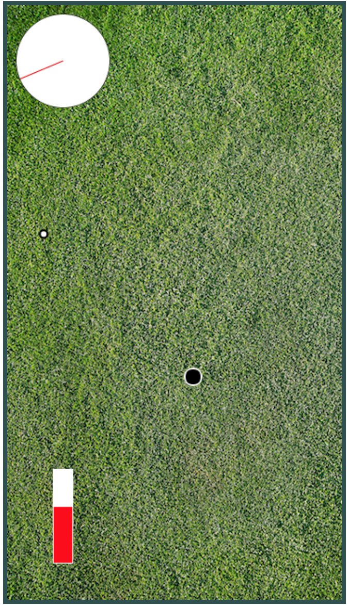

# Game Time Check In # 2

## Instructor Goal Completion

### Screenshot of Current Game State

### GOAL 1 - Full Functional Power Meter
  - [Power Meter Functionality](https://github.com/concach/game-time/blob/dev/lib/power-bar.js#L1-L33)
  - No deviations

### GOAL 2 - Log/Set Current Meter Values with Event Listener

- [Space Bar Triggering](https://github.com/concach/game-time/blob/dev/lib/index.js#L15-L49)
- Slight deviations - the player now holds down the space bar to start the meters. We thought this would be more engaging and precise gameplay
- Comments: We need to refactor this... help with organization of our gameplay, and opinions on how to break out all this functionality, would be much appreciated.

### GOAL 3 - Additional Styling

- see screenshot above
- No deviations
- Comments: Background image is hard-coded into css as background attribute. Is this the best way to do this?

## Next Steps?
- get the ball to disappear and signal the end of that turn when it hits the hole
- refactor code to many functions including: gameLoop, roundOfGolf, playHole, endRound, playerStroke, ballInHole, etc.

### General Questions, Comments, Concerns?
- Should we use RequireJS?

-----

# Instructor Section

### Points for Second Check In (base 50)

* 60 points: Students documented their work well and completed all base goals or have documented where/why they deviated from the goal in a reasonable way. Students completed additional stretch goals.
* **50 points: Students documented their work well and completed all base goals or have documented where/why they deviated from the goal in a reasonable way.**
* 35 points: Students completed all base goals but did not document the work appropriately in their form || did not complete 1 goal and failed to document why in a reasonable way.
* 25 points: Students did not complete more than 1 goal.
* 0 points: Students did not complete check in form prior to eval.

### Instructor's Goals for Next Check In

* Goal 1: Refactoring (possible game class, draw and move functionality in respective classes, etc)

* Goal 2: Ball in hole ends the round

* Goal 3: Obstacles that deflect the ball

* Goal 4: Persist and track of strokes and display score to user

### Stretch Goals

* A second round of difficulty

### Feedback?
