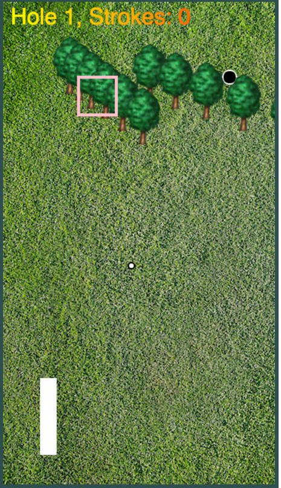

# Game Time Check In # 3

## Instructor Goal Completion

###  Goal 1: Refactoring (possible game class, draw and move functionality in respective classes, etc)

  - Provide a screenshot or gif or link to code for this goal
  [refactoring](https://github.com/concach/game-time/blob/dev/lib/index.js#L15-L19)

###  Goal 2: Ball in hole ends the round

- Provide a screenshot or gif or link to code for this goal
[end hole](https://github.com/concach/game-time/blob/dev/lib/index.js#L26-L33)

### Goal 3: Obstacles that deflect the ball

- Provide a screenshot or gif or link to code for this goal
  

### Goal 4: Persist and track of strokes and display score to user

- Provide a screenshot or gif or link to code for this goal
  

## Next Steps?

- Complete obstacles/sprites conversion. Decide on final course layouts
- Progessive make rounds more difficult based on obstacles/fillmeter/direction speeds
- test
- create ending summary screen/start screen

### General Questions, Comments, Concerns?

-----

# Instructor Section

### Points for Second Check In (base 50)

* 60 points: Students documented their work well and completed all base goals or have documented where/why they deviated from the goal in a reasonable way. Students completed additional stretch goals.
* 50 points: Students documented their work well and completed all base goals or have documented where/why they deviated from the goal in a reasonable way.
* 35 points: Students completed all base goals but did not document the work appropriately in their form || did not complete 1 goal and failed to document why in a reasonable way.
* 25 points: Students did not complete more than 1 goal.
* 0 points: Students did not complete check in form prior to eval.

### Instructor's Goals for Next Check In

These goals should center around wrapping up the game:

 - Matching the [rubric](https://github.com/turingschool/lesson_plans/blob/master/ruby_04-apis_and_scalability/gametime_project.markdown) requirements
 - Refactoring/Cleaning up test coverage
 - Making the game compelling for players
 - Making sure the README and other documentation is up to snuff
 - Making sure the game is deployed

_Note: Instructor/Groups can add additional goals beyond 3. Grading for the next check in will be based on completion of goals_

### Feedback?
