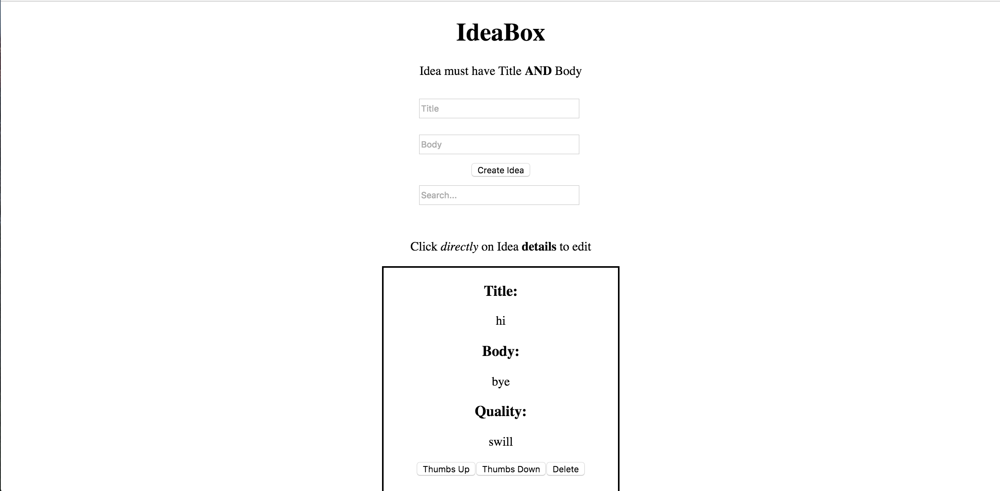
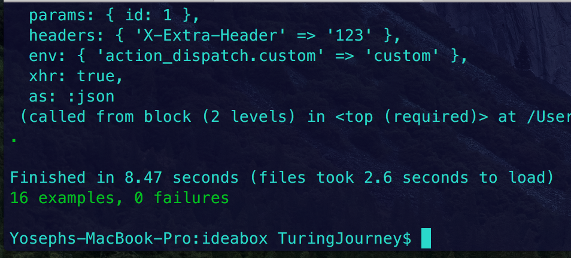

# Ideabox 2.0 Submission Form
[Project Spec](https://github.com/turingschool/curriculum/blob/master/source/projects/revenge_of_idea_box.markdown)

---

### Link to the Github Repository for the Project
[Your Repo](https://github.com/Yoyo2Code/ideabox)

### Link to the Deployed Application
[Your Application](http://aqueous-earth-74411.herokuapp.com/)

### Link to Your Commits in the Github Repository for the Project
[Your Commits](https://github.com/Yoyo2Code/ideabox/commits/master)

### Provide a Screenshot of your Application

## Completion

### Were you able to complete the base functionality?
* Yes, all functionality is completed.

### Which extensions, if any, did you complete?

* N/A

### Attach a .gif, or images of any extensions work being used on the site.

# Code Quality

### Link to a specific block of your code on Github that you are proud of

[Code Snippet](https://gist.github.com/Yoyo2Code/8038211fa2b1ed5b1169a42c9269923d)

* I was proud of this code because of the problem it presented that I had not seen before.

### Link to a specific block of your code on Github that you feel not great about

[Code Snippet](https://gist.github.com/Yoyo2Code/fad874383de2a29e62c3981a2ad11bf6)
* I do not like this code due to the multiple responsibilities that this method has. This method can be refactored into a different ajax call function, and the if statements can be put into one function that determines the output. It's incredibly sloppy, but accomplishes the job in the time frame.

### Attach a screenshot or paste the output from your terminal of the result of your test-suite running.

### Provide a link to an example, if you have one, of a test that covers an 'edge case' or 'unhappy path'

[Link to Code](https://gist.github.com/Yoyo2Code/684b0ae762df13f75191d7a41cfbe773)

-----

### Please feel free to ask any other questions or make any other statements below!

### Data Model

(5 points total.)

### User Flows

#### Viewing ideas

(4/10 points total.)

* Idea bodies longer than 100 characters should be truncated to the nearest word. (2/5 points)
* Ideas should appear in descending chronological order (with the most recently created idea at the top). (3 points)

#### Adding a new idea

(15 points total.)

#### Deleting an existing idea

(15 points total.)

#### Changing the quality of an idea

(15 points total.)

#### Editing an existing idea

(20 points total.)

#### Idea Filtering and Searching

(15 points total.)

## Instructor Evaluation Points

### Specification Adherence

* **10 points**: The application consists of one page with all of the major functionality being provided by jQuery. There is no use of `format.js` in Rails. There is no use of unobstrusive JavaScript. There are no front-end frameworks used in the application. No approach was taken that is counter to the spirit of the project and its learning goals. There are no features missing from above that make the application feel incomplete or hard to use.

### User Interface

* **5 points** - The application is pleasant, logical, and easy to use. There no holes in functionality and the application stands on it own to be used by the instructor _without_ guidance from the developer.

### Testing

* **9 points** - Project has a running test suite that tests and multiple levels but fails to cover some features. All controller actions are covered by tests. The application makes some use of integration testing.

### Ruby and Rails Quality

* **10 points** - Developer is able to craft Rails features that make smart use of Ruby, follow the principles of MVC, and push business logic down where it belongs. There _zero_ instances where an instructor would recommend taking a different approach. Developer writes code that is exceptionally clear and well-factored. Application is expertly divided into logical components each with a clear, single responsibility.

### JavaScript Style

* **8 points** - Application is thoughtfully put together with some duplication and no major bugs. Developer can speak to choices made in the code and knows what every line of code is doing.

### Workflow

* **9 points** - The developer effectively uses Git branches and many small, atomic commits that document the evolution of their application.
