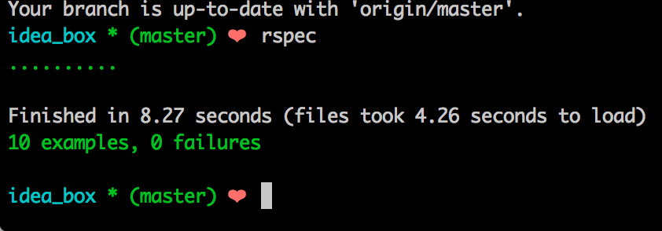

# Basics

### Link to the Github Repository for the Project
[Your Repo](https://github.com/deborahleehamel/idea_box)

### Link to the Deployed Application
[Your Application](http://my-idea-box.herokuapp.com/)

### Link to Your Commits in the Github Repository for the Project
[Your Commits](https://github.com/deborahleehamel/idea_box/commits/master)

### Provide a Screenshot of your Application

## Completion

### Were you able to complete the base functionality?
* If not, list what functionality is missing.
Idea bodies longer than 100 characters should be truncated
Idea Filtering and Searching

### Which extensions, if any, did you complete?

### Attach a .gif, or images of any extensions work being used on the site.

# Code Quality

### Link to a specific block of your code on Github that you are proud of
* Why were you proud of this piece of code?
https://github.com/deborahleehamel/idea_box/blob/master/app/assets/javascripts/ideas.js#L11-L24
This was my first project built out with javascript. My first foray into jQuery, so I was pleased that I got it to work.

### Link to a specific block of your code on Github that you feel not great about
* Why do you feel not awesome about the code? What challenges did you face trying to write/refactor it?
https://github.com/deborahleehamel/idea_box/blob/master/app/assets/javascripts/ideas.js#L63-L79

I was only able to build part of this feature. I tried to use on.('change'), but didn't get there with it and ran out of time.
https://github.com/deborahleehamel/idea_box/blob/more_testing/spec/features/user_can_delete_idea_spec.rb#L10
Not able to get capybara to click on a specific "Delete" button. Tried passing selectors and/or my specific idea.id within, using find and match examples to click on "Delete" button.

### Attach a screenshot or paste the output from your terminal of the result of your test-suite running.

### Provide a link to an example, if you have one, of a test that covers an 'edge case' or 'unhappy path'
https://github.com/deborahleehamel/idea_box/blob/more_testing/spec/models/idea_spec.rb#L10-L23

-----

### Please feel free to ask any other questions or make any other statements below!
