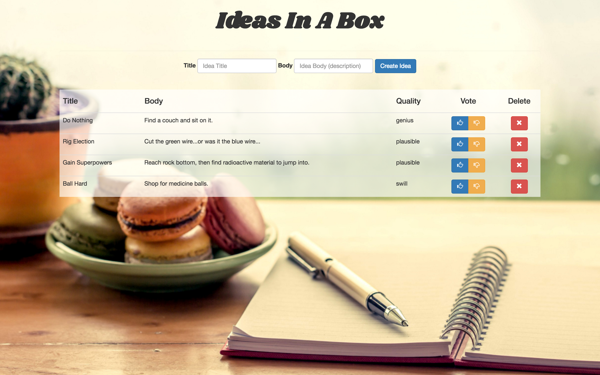
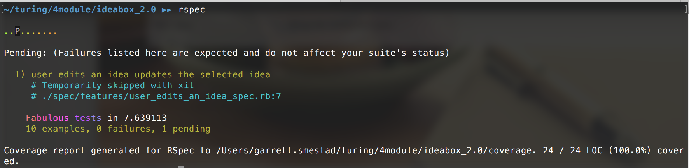

# Ideabox 2.0 Submission Form
[Project Spec](https://github.com/turingschool/curriculum/blob/master/source/projects/revenge_of_idea_box.markdown)

* Fork this repo, if you haven't already and check out a branch
* Use this README as a template to create a file in this folder with your name as the title.
* Submit a pull request
* Pro Tip: You can use [recordit.co](http://recordit.co/) to record interaction gifs.
* Secondary Pro Tip: [Here's how to link to specific line number(s) in Github](http://stackoverflow.com/questions/23821235/how-to-link-to-specific-line-number-on-github)
* Tertiary Pro Tip: You can re-use some of these things in your portfolio/resume

------

# Basics

### Link to the Github Repository for the Project
[My GitHub Repo](https://github.com/GSmes/ideabox_2.0)

### Link to the Deployed Application
[My Heroku Application](https://ideasinabox.herokuapp.com/)

### Link to Your Commits in the Github Repository for the Project
[My Git Commits](https://github.com/GSmes/ideabox_2.0/commits/master)

### Provide a Screenshot of your Application

## Completion

### Were you able to complete the base functionality?
No.

_Functionality missing:_
* Idea filtering and searching

### Which extensions, if any, did you complete?
None.

# Code Quality

### Link to a specific block of your code on Github that you are proud of
[(updateAjax)](https://github.com/GSmes/ideabox_2.0/blob/master/app/assets/javascripts/vote.js#L44)
* I'm proud of this because initially I was getting it to save the updated quality in the database, but it often wasn't reflecting on the page. My initial solution was _extremely_ lengthy, and contained traversals like `.parent().parent().parent().prev()`. It took me longer than I care to admit to figure out a concise, accurate way of updating what's on the page (like using `.closest("td")`).

### Link to a specific block of your code on Github that you feel not great about
[(parseInt)](https://github.com/GSmes/ideabox_2.0/blob/master/app/assets/javascripts/vote.js#L10)
* I'm pretty proud of all my code, I guess, so I'm just picking my least favorite. I'm not proud of my use of `parseInt` so frequently. I initially only had it in my updateAjax method, but for some reason that I was never able to figure out, voting would occasionally fail, and I was at a point of frustration, so I ended up just putting it everywhere that it _might_ need to be.

### Attach a screenshot or paste the output from your terminal of the result of your test-suite running.

### Provide a link to an example, if you have one, of a test that covers an 'edge case' or 'unhappy path'

-----

### Please feel free to ask any other questions or make any other statements below!

### Data Model

(5 points total.)

### User Flows

#### Viewing ideas

(10 points total.)

#### Adding a new idea

(15 points total.)

#### Deleting an existing idea

(15 points total.)

#### Changing the quality of an idea

(15 points total.)

#### Editing an existing idea

(20 points total.)

#### Idea Filtering and Searching

(0/15 points total.)

We'd like our users to be able to easily find specific ideas they already created, so
let's provide them with a filtering interface on the idea list.

* At the top of the idea list, include a text field labeled "Search". (3 points)
* As a user types in the search box, the list of ideas should filter in real time to only display ideas whose title or body include the user's text. The page _should not_ reload. (6 points)
* Clearing the search box should restore all the ideas to the list. (6 points)

## Instructor Evaluation Points

### Specification Adherence

* **10 points**: The application consists of one page with all of the major functionality being provided by jQuery. There is no use of `format.js` in Rails. There is no use of unobstrusive JavaScript. There are no front-end frameworks used in the application. No approach was taken that is counter to the spirit of the project and its learning goals. There are no features missing from above that make the application feel incomplete or hard to use.

### User Interface

* **5 points** - The application is pleasant, logical, and easy to use. There no holes in functionality and the application stands on it own to be used by the instructor _without_ guidance from the developer.

### Testing

* **8 points** - Project has a running test suite that tests and multiple levels but fails to cover some features. All controller actions are covered by tests. The application makes some use of integration testing.

### Ruby and Rails Quality

* **10 points** - Developer is able to craft Rails features that make smart use of Ruby, follow the principles of MVC, and push business logic down where it belongs. There _zero_ instances where an instructor would recommend taking a different approach. Developer writes code that is exceptionally clear and well-factored. Application is expertly divided into logical components each with a clear, single responsibility.

### JavaScript Style

* **9 points** - Application is thoughtfully put together with some duplication and no major bugs. Developer can speak to choices made in the code and knows what every line of code is doing.

### Workflow

* **10 points** - The developer effectively uses Git branches and many small, atomic commits that document the evolution of their application.
