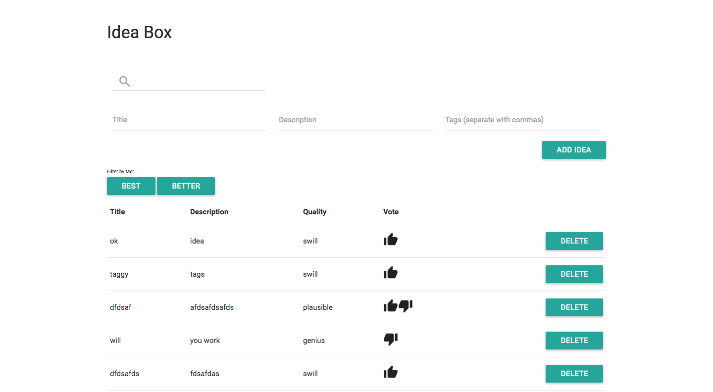
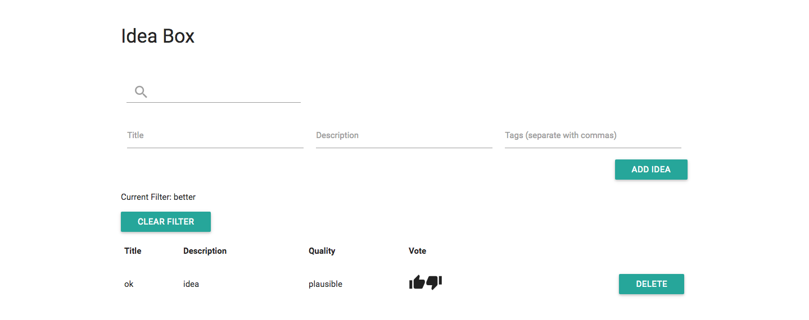

# Ideabox 2.0 Submission Form
[Project Spec](https://github.com/turingschool/curriculum/blob/master/source/projects/revenge_of_idea_box.markdown)

------

# Basics

### Link to the Github Repository for the Project
[My Repo](https://github.com/kjs222/idea_box)

### Link to the Deployed Application
[My Application](http://mysterious-mesa-11952.herokuapp.com/)

### Link to Your Commits in the Github Repository for the Project
[My Commits on Master](https://github.com/kjs222/idea_box/commits/master)
[My Commits with React](https://github.com/kjs222/idea_box/commits/react_1)

### Provide a Screenshot of your Application


## Completion

### Were you able to complete the base functionality?
* Yes

### Which extensions, if any, did you complete?
* Tags and filtering by tags (all on single page)
* Not an approved extension: React version (partial)

### Attach a .gif, or images of any extensions work being used on the site.


# Code Quality

### Link to a specific block of your code on Github that you are proud of
[Test Assertions On Order of Tags(and non duplication)](https://github.com/kjs222/idea_box/blob/master/spec/features/user_can_add_idea_spec.rb#L34-L37)
* By choice, I spent the majority of time on this project on testing (the Jquery functionality wasn't that new to me, but quality testing of Jquery functionality was).  Also, I tried to avoid giving elements id's or classes simply to facilitate tests.  This made me rely on finding elements in more "difficult" ways.  This snippet shows an example of a test that makes sure that the tags of a newly created item are only added if they aren't already there, and are inserted to maintain alpha order.

[Animation to Show User that Quality Updated)](https://github.com/kjs222/idea_box/blob/master/app/assets/javascripts/change_quality.js#L26-L29)
* I added an animation to to a brief increase in text size on the quality after it changes to show user that something happened after clicking the thumb buttons.

### Link to a specific block of your code on Github that you feel not great about

[Handling of Up and Down Votes](https://github.com/kjs222/idea_box/blob/master/app/assets/javascripts/change_quality.js#L1-L17)

* Super duplicative.  Lots of opportunities to refactor.  How I handled it in the react version is much cleaner.  


### Attach a screenshot or paste the output from your terminal of the result of your test-suite running.
```
Deprecation Warnings:

Using `should` from rspec-expectations' old `:should` syntax without explicitly enabling the syntax is deprecated. Use the new `:expect` syntax or explicitly enable `:should` with `config.expect_with(:rspec) { |c| c.syntax = :should }` instead. Called from /Users/kerrysheldon/turing/4module/projects/idea_box/spec/features/user_can_search_ideas_spec.rb:13:in `block (2 levels) in <top (required)>'.


If you need more of the backtrace for any of these deprecations to
identify where to make the necessary changes, you can configure
`config.raise_errors_for_deprecations!`, and it will turn the
deprecation warnings into errors, giving you the full backtrace.

1 deprecation warning total

Finished in 24.24 seconds (files took 9.37 seconds to load)
31 examples, 0 failures
```

### Provide a link to an example, if you have one, of a test that covers an 'edge case' or 'unhappy path'

-----
[Edge Case Test for Missing Required Fields](https://github.com/kjs222/idea_box/blob/master/spec/features/user_can_add_idea_spec.rb#L51-L69)

### Please feel free to ask any other questions or make any other statements below!

Rather than refactor, I decided to spend my last day and a half on learning React by transitioning my IdeaBox into a React app.  I have a branch titled react_1 with that version. I was able to get the following functionality complete:
*  listing all ideas
*  adding an idea
*  changing quality of idea
*  deleting an idea
*  changing title and body elements to be editable (but haven't finished it to have them actually edit...)


+17
+5

## Instructor Evaluation Points

### Specification Adherence

* **10 points**: The application consists of one page with all of the major functionality being provided by jQuery. There is no use of `format.js` in Rails. There is no use of unobstrusive JavaScript. There are no front-end frameworks used in the application. No approach was taken that is counter to the spirit of the project and its learning goals. There are no features missing from above that make the application feel incomplete or hard to use.

### User Interface

* **5 points** - The application is pleasant, logical, and easy to use. There no holes in functionality and the application stands on it own to be used by the instructor _without_ guidance from the developer.

### Testing

* **8 points** - Project has a running test suite that tests and multiple levels but fails to cover some features. All controller actions are covered by tests. The application makes some use of integration testing.

### Ruby and Rails Quality
  Small suggestions for refactoring to follow MVC principals

* **9 points** - Developer is able to craft Rails features that make smart use of Ruby, follow the principles of MVC, and push business logic down where it belongs. There _zero_ instances where an instructor would recommend taking a different approach. Developer writes code that is exceptionally clear and well-factored. Application is expertly divided into logical components each with a clear, single responsibility.

### JavaScript Style

* **8 points** - Application is thoughtfully put together with some duplication and no major bugs. Developer can speak to choices made in the code and knows what every line of code is doing.

### Workflow

* **10 points** - The developer effectively uses Git branches and many small, atomic commits that document the evolution of their application.
