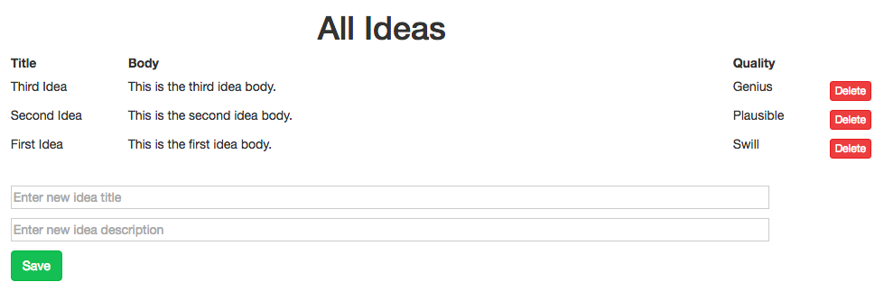
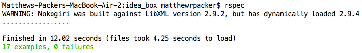

# Ideabox 2.0 Submission Form
[Project Spec](https://github.com/turingschool/curriculum/blob/master/source/projects/revenge_of_idea_box.markdown)

[GitHub URL](https://github.com/matthewrpacker/idea_box)

[Heroku URL](https://ideacontainer.herokuapp.com/)

[My Commits](https://github.com/matthewrpacker/idea_box/commits/master)

## Completion

### Were you able to complete the base functionality?
* No.
* Missing:
  * Changing the quality of an idea
  * Editing an existing idea
  * Idea filtering and searching

### Which extensions, if any, did you complete?
* N/A
### Attach a .gif, or images of any extensions work being used on the site.
* N/A
# Code Quality

### Link to a specific block of your code on Github that you are proud of
[Truncate Sentence](https://github.com/matthewrpacker/idea_box/blob/af7d71bca1b747db55e524d12f3d1a63f96f7259/app/assets/javascripts/create_idea.js#L23-L29)
* Why were you proud of this piece of code?
  * I felt like I gained a solid understanding of both `.substr()` and `.lastIndexOf`, and was able to use the appropriately in my project.

### Link to a specific block of your code on Github that you feel not great about
[New Idea HTML Var](https://github.com/matthewrpacker/idea_box/blob/af7d71bca1b747db55e524d12f3d1a63f96f7259/app/assets/javascripts/create_idea.js#L32)
* Why do you feel not awesome about the code? What challenges did you face trying to write/refactor it?
  * Just because it is a very long line of code.
  * I ran out of time, so I did not try to refactor this line of code.

### Attach a screenshot or paste the output from your terminal of the result of your test-suite running.

### Provide a link to an example, if you have one, of a test that covers an 'edge case' or 'unhappy path'
[Delete Newly Created Idea Spec](https://github.com/matthewrpacker/idea_box/blob/af7d71bca1b747db55e524d12f3d1a63f96f7259/spec/features/user_can_delete_an_idea_spec.rb#L4-L26)
-----

### Please feel free to ask any other questions or make any other statements below!

### Data Model

(5 points total.)

### User Flows

#### Viewing ideas

(10 points total.)

#### Adding a new idea

(15 points total.)

#### Deleting an existing idea

(15 points total.)

#### Changing the quality of an idea

(3/15 points total.)

* Clicking thumbs up on the idea should increase its quality one notch ("swill" → "plausible",
  "plausible" → "genius"). (4 points)
* Clicking thumbs down on the idea should decrease its quality one notch ("genius" → "plausible",
  "plausible" → "swill"). (4 points)
* Incrementing a "genius" idea or decrementing a "swill" idea should have no effect. (4 points)

#### Editing an existing idea

(0/20 points total.)

* When a user clicks the title or body of an idea in the list, that text should become an editable text field, pre-populated with the existing idea title or body. (8 points)
* Clicking this link should _not_ take the user to a separate "edit" page for the given
  idea. (4 points, mandatory for specification adherence)
*  The user should be able to "commit" their changes by pressing "Enter/Return" or by clicking outside of the text field. (4 points)
* If the user reloads the page, their edits will be reflected. (4 points, mandatory for specification adherence)

#### Idea Filtering and Searching

(0/15 points total.)

We'd like our users to be able to easily find specific ideas they already created, so
let's provide them with a filtering interface on the idea list.

* At the top of the idea list, include a text field labeled "Search". (3 points)
* As a user types in the search box, the list of ideas should filter in real time to only display ideas whose title or body include the user's text. The page _should not_ reload. (6 points)
* Clearing the search box should restore all the ideas to the list. (6 points)

## Instructor Evaluation Points

### Specification Adherence

* **0/10 points**: The application consists of one page with all of the major functionality being provided by jQuery. There is no use of `format.js` in Rails. There is no use of unobstrusive JavaScript. There are no front-end frameworks used in the application. No approach was taken that is counter to the spirit of the project and its learning goals. There are no features missing from above that make the application feel incomplete or hard to use.

### User Interface

* **5 points** - The application is pleasant, logical, and easy to use. There no holes in functionality and the application stands on it own to be used by the instructor _without_ guidance from the developer.

### Testing

* **8 points** - Project has a running test suite that tests and multiple levels but fails to cover some features. All controller actions are covered by tests. The application makes some use of integration testing.

### Ruby and Rails Quality

* **9 points** - Developer solves problems with a balance between conciseness and clarity and often extracts logical components. Developer can speak to choices made in the code and knows what every line of code is doing.

### JavaScript Style

* **9 points** - Application is thoughtfully put together with some duplication and no major bugs. Developer can speak to choices made in the code and knows what every line of code is doing.

### Workflow

* **10 points** - The developer effectively uses Git branches and many small, atomic commits that document the evolution of their application.
