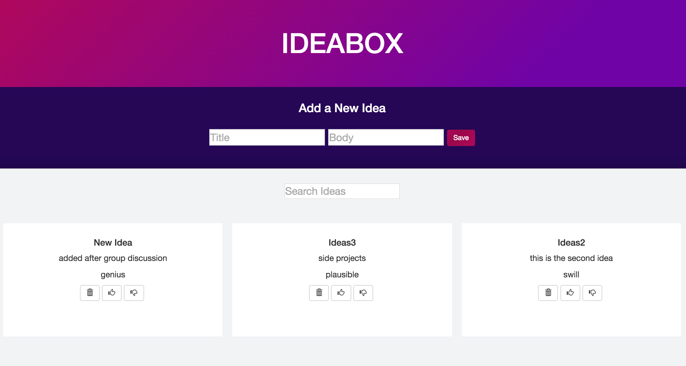
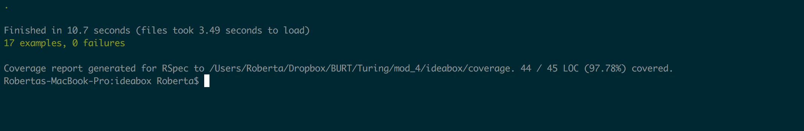

# Ideabox 2.0 - Roberta Doyle

------

# Basics

### Link to the Github Repository for the Project
[Repo](https://github.com/roscalabrin/ideabox)

### Link to the Deployed Application
[Heroku](https://myideabox.herokuapp.com/)

### Link to Your Commits in the Github Repository for the Project
[Commits](https://github.com/roscalabrin/ideabox/commits/master)

### Provide a Screenshot of your Application

## Completion

### Were you able to complete the base functionality?
* Yes

# Code Quality

### Link to a specific block of your code on Github that you are proud of
+[Code Link](https://github.com/roscalabrin/ideabox/blob/master/app/assets/javascripts/ideabox.js.es6#L1-L15)

* Why were you proud of this piece of code?
I'm happy with how I organized the my js files and classes.

### Link to a specific block of your code on Github that you feel not great about
+[Code Link](https://github.com/roscalabrin/ideabox/blob/master/app/assets/javascripts/ideas_index.js.es6#L2-L19)

* Why do you feel not awesome about the code? What challenges did you face trying to write/refactor it?
It's a very long method, I couldn't figure it out how to break it into smaller methods.

### Attach a screenshot or paste the output from your terminal of the result of your test-suite running.

### Provide a link to an example, if you have one, of a test that covers an 'edge case' or 'unhappy path'

-----

### Please feel free to ask any other questions or make any other statements below!

### Data Model

(5 points total.)

### User Flows

#### Viewing ideas

(10 points total.)

#### Adding a new idea

(15 points total.)

#### Deleting an existing idea

(15 points total.)

#### Changing the quality of an idea

(15 points total.)

#### Editing an existing idea

(20 points total.)

#### Idea Filtering and Searching

(9/15 points total.)

We'd like our users to be able to easily find specific ideas they already created, so
let's provide them with a filtering interface on the idea list.

* As a user types in the search box, the list of ideas should filter in real time to only display ideas whose title or body include the user's text. The page _should not_ reload. (6 points)

## Instructor Evaluation Points

### Specification Adherence

* **10 points**: The application consists of one page with all of the major functionality being provided by jQuery. There is no use of `format.js` in Rails. There is no use of unobstrusive JavaScript. There are no front-end frameworks used in the application. No approach was taken that is counter to the spirit of the project and its learning goals. There are no features missing from above that make the application feel incomplete or hard to use.

### User Interface

* **5 points** - The application is pleasant, logical, and easy to use. There no holes in functionality and the application stands on it own to be used by the instructor _without_ guidance from the developer.

### Testing

* **8 points** - Project has a running test suite that tests and multiple levels but fails to cover some features. All controller actions are covered by tests. The application makes some use of integration testing.

### Ruby and Rails Quality

* **9 points** - Developer solves problems with a balance between conciseness and clarity and often extracts logical components. Developer can speak to choices made in the code and knows what every line of code is doing.

### JavaScript Style

* **7 points** - Your application has some duplication and minor bugs. Developer can speak to most choices made in the code and knows what every line is doing.

### Workflow

* **10 points** - The developer effectively uses Git branches and many small, atomic commits that document the evolution of their application.
