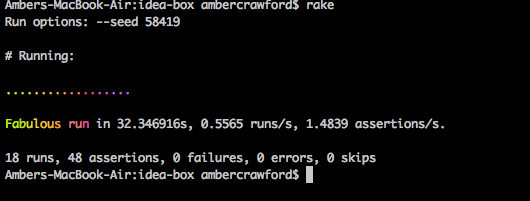

# Basics

### Github Repository for the Project:
[My Repo](https://github.com/amcrawford/idea-box.js)

### Link to the Deployed Application:
[My Application](https://cryptic-forest-91322.herokuapp.com/)

### Link to My Commits in the Github Repository for the Project
[My Commits](https://github.com/amcrawford/idea-box.js/commits/master)

### Screenshot of My Application

## Completion

### Were you able to complete the base functionality?
Yes, I was able to complete functionality.

### Which extensions, if any, did you complete?
I completed all three extensions with some small functionality issues.
* Inline Editing:
  Only saves on "Enter" keydown, not by clicking out of text-box.

    
* Tagging: Need to refresh after filtering by tag to view all ideas again.

    
* Sorting: Works in both directions but, cannot use other AJAX functions after sort until refreshing page (e.g. Thumbs-Up/ Edit).

    

# Code Quality

### Code I am Proud of:
I am really proud of my [sort functionality](https://github.com/amcrawford/idea-box.js/blob/master/app/assets/javascripts/sort_ideas.js).  It ended up being a fairly simple solution to a complex problem and was really excited to have it work out so easily.

### Code I am Not Especially Prout of:

I am not particularly excited about my solution for [changing quality](https://github.com/amcrawford/idea-box.js/blob/master/app/assets/javascripts/change_quality.js).  It was one of the first methods that I wrote and, while it definitely works, I am positive there is a more elegant solution.

### Test Suite

### Provide a link to an example, if you have one, of a test that covers an 'edge case' or 'unhappy path':
[Link to tests](https://github.com/amcrawford/idea-box.js/blob/master/test/integration/can_add_new_idea_test.rb#L22-L36)

-----

## Scores

### Data Model

(5 points total.)

### User Flows

#### Viewing ideas

(10 points total.)

#### Adding a new idea

(15 points total.)

#### Deleting an existing idea

(15 points total.)

#### Changing the quality of an idea

(15 points total.)

#### Editing an existing idea

(20 points total.)

#### Idea Filtering and Searching

(15 points total.)

### Extensions

Extensions are a great way to earn additional points beyond the 150 available in this project. That said, awarding points for delivering a given extension is up to the instructor, who may only award partial points depending on the quality of the implementation. The points listed below represent the maximum number of points. Extensions can _not_ be done after the fact without instructor permission in advance.

#### Inline idea editing

(10 additional points.)

When a user clicks the title or idea of an idea in the list, that text should become an editable text field, pre-populated with the existing idea title or body. The user should be able to "commit" their changes by pressing "Enter/Return" or by clicking outside of the text field.

#### Tagging

(15 additional points.)

Add an optional third text field upon idea creation for "Tags". Tags should be a comma-separated list of short text tags, and should be processed on the server such that any existing tags are re-used, and any new ones are created. Once there are tags to display, a list of existing tags should appear at the top of the idea list. Clicking one of these tags should show only ideas that include it. When viewing ideas filtered by tag, be sure to include a link to take the user back to "All Ideas". This filtering could be implemented either as a separate page or via javascript within the same interface.

#### Sorting

(5 additional points.)

When viewing the ideas list, the user should have the option to sort ideas by Quality. The default sort should be descending ("genius" → "plausible" → "swill"), and clicking the sort a second time should reverse it. The Idea list should be sorted client-side without reloading the page.

## Instructor Evaluation Points

### Specification Adherence

* **10 points**: The application consists of one page with all of the major functionality being provided by jQuery. There is no use of `format.js` in Rails. There is no use of unobstrusive JavaScript. There are no front-end frameworks used in the application. No approach was taken that is counter to the spirit of the project and its learning goals. There are no features missing from above that make the application feel incomplete or hard to use.

### User Interface

* **5 points** - The application is pleasant, logical, and easy to use. There no holes in functionality and the application stands on it own to be used by the instructor _without_ guidance from the developer.

### Testing

* **8 points** - Project has a running test suite that tests and multiple levels but fails to cover some features. All controller actions are covered by tests. The application makes some use of integration testing.

### Ruby and Rails Quality

* **8 points** - Developer solves problems with a balance between conciseness and clarity and often extracts logical components. Developer can speak to choices made in the code and knows what every line of code is doing.

### JavaScript Style

* **8 points** - Application is thoughtfully put together with some duplication and no major bugs. Developer can speak to choices made in the code and knows what every line of code is doing.

### Workflow

* **10 points** - The developer effectively uses Git branches and many small, atomic commits that document the evolution of their application.
