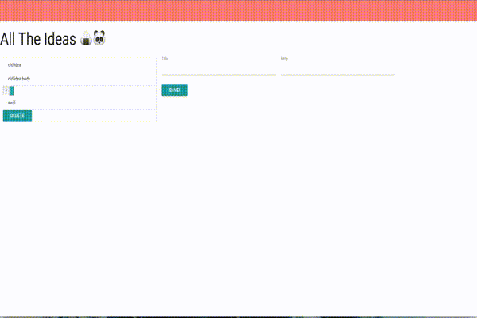
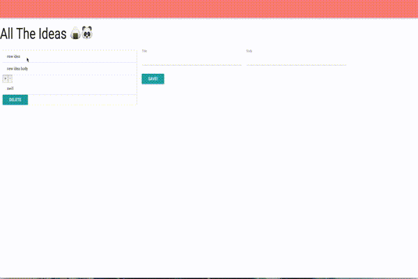
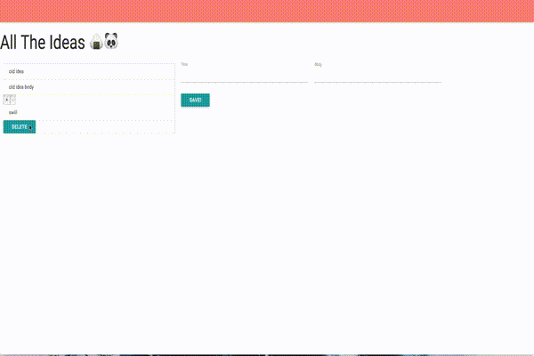
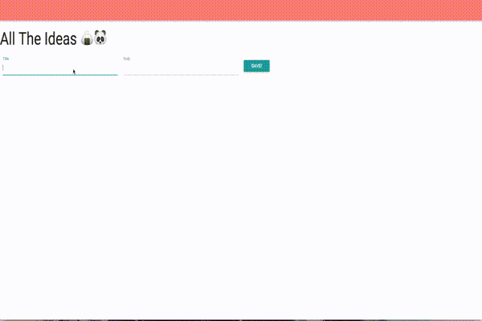
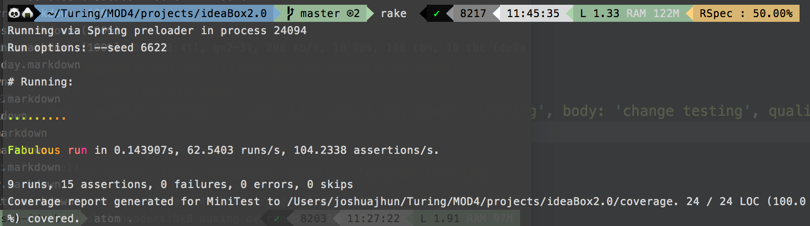

# Ideabox 2.0 Submission Form
[Project Spec](https://github.com/turingschool/curriculum/blob/master/source/projects/revenge_of_idea_box.markdown)

* Fork this repo, if you haven't already and check out a branch
* Use this README as a template to create a file in this folder with your name as the title.
* Submit a pull request
* Pro Tip: You can use [recordit.co](http://recordit.co/) to record interaction gifs.
* Secondary Pro Tip: [Here's how to link to specific line number(s) in Github](http://stackoverflow.com/questions/23821235/how-to-link-to-specific-line-number-on-github)
* Tertiary Pro Tip: You can re-use some of these things in your portfolio/resume

------

# Basics

### Link to the Github Repository for the Project
* [My Yung-Repo](https://github.com/joshuajhun/ideaBox2.0)  

### Link to the Deployed Application
* [My Yung-Application](http://idea-box-jhun.herokuapp.com)

### Link to Your Commits in the Github Repository for the Project
* [All of my Yung-Commits](https://github.com/joshuajhun/ideaBox2.0/commits/)

### Provide a Screenshot of your Application
* 
* 
* 
* 
* 

## Completion

### Were you able to complete the base functionality?
* Yes I was :D
#### If not, list what functionality is missing.

### Which extensions, if any, did you complete?
* I completed the inline edit function

### Attach a .gif, or images of any extensions work being used on the site.
* 

# Code Quality

### Link to a specific block of your code on Github that you are proud of
* [link to code](https://github.com/joshuajhun/ideaBox2.0/blob/master/app/assets/javascripts/ideabox_service.js#L51-L72)
#### Why were you proud of this piece of code?
* I am proud of this code because It took me forever to really get and understand. I feel like this function really solidified the way I debug things. I was able to console log my clicks and from there really put together how to inline edit the idea name. It was a good struggle because it hit all the areas of JavaScript I wanted to get better at
### Link to a specific block of your code on Github that you feel not great about
[link to code] (https://github.com/joshuajhun/ideaBox2.0/blob/master/app/assets/javascripts/ideabox_service.js#L95-L119)
#### Why do you feel not awesome about the code? What challenges did you face trying to write/refactor it?
* it's messy. I feel like there is such a better and cleaner way to implement an easy function. This method is  somethings that took me a while to get and understand.

### Attach a screenshot or paste the output from your terminal of the result of your test-suite running.

### Provide a link to an example, if you have one, of a test that covers an 'edge case' or 'unhappy path'

-----

### Please feel free to ask any other questions or make any other statements below!

---

## Points

Good naming, good handle of abstraction. Very easy to read. Could be more consistent in style. Models need test. Client-side testing needed. Solid project.

**Overall Points**: 156

### Project Requirements

* Data Model - 5 points
* Viewing Ideas - 10 points
* Adding a New Idea - 15 points
* Deleting an Existing Idea - 15 points
* Changing the Quality of the Idea - 15 points
* Editing an Existing Idea - 20 points
* Idea Filtering and Searching - 15 points
* Inline Idea Editing - 10 points

### Instructor Evaluation Points

* Specification Adherence - 10 points
* User Interface - 5 points
* Testing - 5 points
* Ruby on Rails Quality - 10 points
* JavaScript Style - 8 points
* Workflow - 8 points
