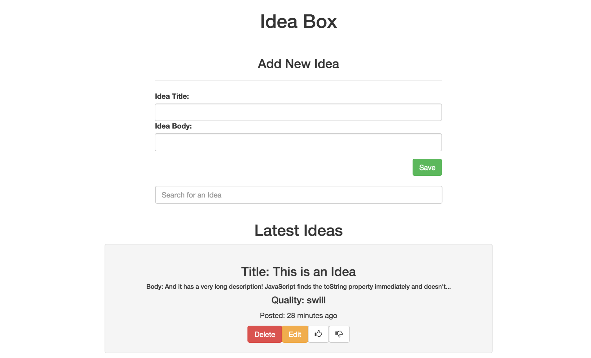

# Basics

### Link to the Github Repository for the Project
[My Repo](https://github.com/matt-stj/ideabox_js)

### Link to the Deployed Application
[My Application](http://matts-idea-box-js.herokuapp.com/)

### Link to Your Commits in the Github Repository for the Project
[My Commits](https://github.com/matt-stj/ideabox_js/commits/master)

### Provide a Screenshot of your Application

## Completion

### Were you able to complete the base functionality?
* Yes

### Which extensions, if any, did you complete?
* inline editing

# Code Quality

### Link to a specific block of your code on Github that you are proud of
[inline_editing](https://github.com/matt-stj/ideabox_js/blob/master/app/assets/javascripts/inline_editing.js)

#### Why were you proud of this piece of code?
* I had a tough time figuring out how to fire off the AJAX call at the right time.  Eventually figured out how to disable certain keypress events and enable others, that allowed me to save the updated field to the database.

### Link to a specific block of your code on Github that you feel not great about
[js_testing](https://github.com/matt-stj/ideabox_js/blob/master/test/integration/add_idea_test.rb)

#### Why do you feel not awesome about the code? What challenges did you face trying to write/refactor it?
* Couldn't get Capybara to delete my test database after each test run, so have to do it manually for each test.  Seemed pretty repetitive, but had no luck getting DB Cleaner to work with Selenium.

### Attach a screenshot or paste the output from your terminal of the result of your test-suite running.

### Provide a link to an example, if you have one, of a test that covers an 'edge case' or 'unhappy path'
* [cant_update_beyond_genius](https://github.com/matt-stj/ideabox_js/blob/master/test/integration/upgrade_idea_test.rb)

-----

### Please feel free to ask any other questions or make any other statements below!

---

## Points

Tests included feature tests. Minor refactoring opportunities in a controller action that creates an idea. Duplication could be removed from couple of functions. String interpolation would have made Matt's life easier. Good job overall.

**Overall Points**: 156

### Project Requirements

* Data Model - 5 points
* Viewing Ideas - 10 points
* Adding a New Idea - 15 points
* Deleting an Existing Idea - 15 points
* Changing the Quality of the Idea - 15 points
* Editing an Existing Idea - 20 points
* Idea Filtering and Searching - 15 points
* Inline Idea Editing - 10 points

### Instructor Evaluation Points

* Specification Adherence - 10 points
* User Interface - 5 points
* Testing - 10 points
* Ruby on Rails Quality - 8 points
* JavaScript Style - 8 points
* Workflow - 10 points
