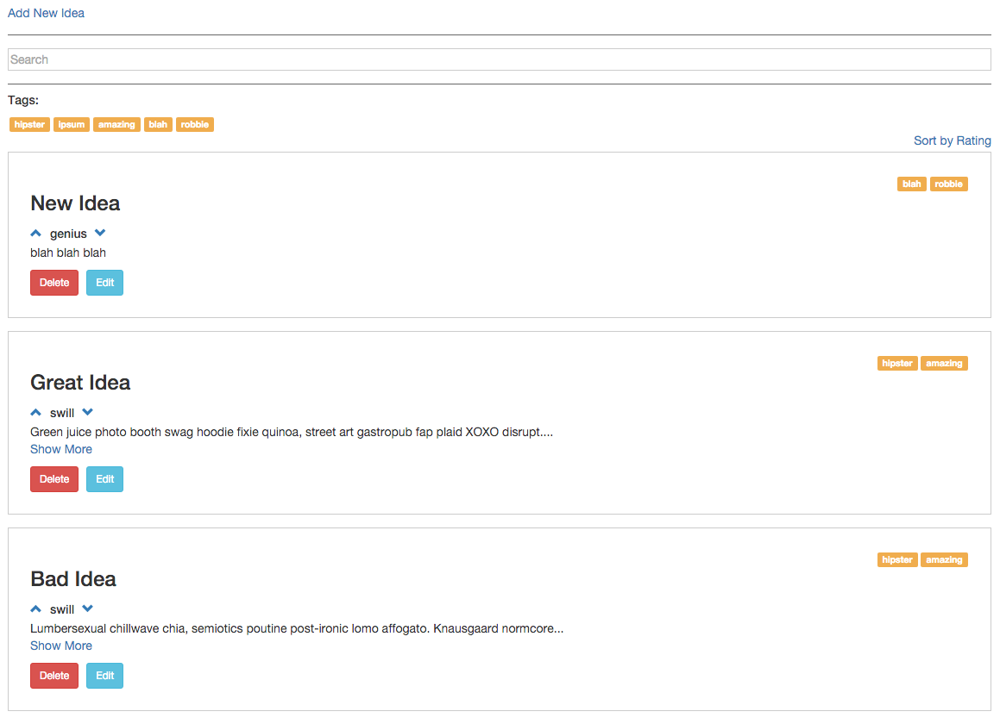
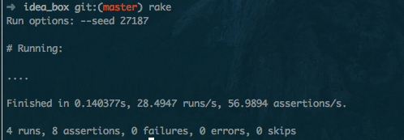

# Basics

### Link to the Github Repository for the Project
[My Repo](http://github.com/robbielane/idea_box_js)

### Link to the Deployed Application
[My Application](http://idea-box-rl.herokuapp.com)

### Link to Your Commits in the Github Repository for the Project
[My Commits](https://github.com/robbielane/idea_box_js/commits/master)

### Provide a Screenshot of your Application

## Completion

### Were you able to complete the base functionality?
* YES!

### Which extensions, if any, did you complete?
* sorting

* tagging

# Code Quality

### Link to a specific block of your code on Github that you are proud of
[Ratings](https://github.com/robbielane/idea_box_js/blob/master/app/assets/javascripts/ratings.js.es6#L3-L18)

#### Why were you proud of this piece of code?
* I originally, had a lot of repetition in this bit of code. I was able to chunk out most of the code and reuse it for both up-votes and down-votes.

### Link to a specific block of your code on Github that you feel not great about
[sort](https://github.com/robbielane/idea_box_js/blob/master/app/assets/javascripts/sort.js.es6#L1-L30)

#### Why do you feel not awesome about the code? What challenges did you face trying to write/refactor it?
* It was challenging to figure out a way to have the same sort link change the sort order for each consecutive click. I ended up creating a clickCount variable and then reversing the sort on odd clicks... Certainly, there is a better way.

### Attach a screenshot or paste the output from your terminal of the result of your test-suite running.
* 😔

### Provide a link to an example, if you have one, of a test that covers an 'edge case' or 'unhappy path'
* 😔

-----

### Please feel free to ask any other questions or make any other statements below!

---

## Points

Good UX and functionality. Added two extensions. A bit more polish needed on tag functionality to remove unused tags and to add new tags without reloading. Testing is uneven. Monkey patching String prototype to add functionality is not recommended. Solid work overall, good quality.

**Overall Points**: 171

### Project Requirements

* Data Model - 5 points
* Viewing Ideas - 10 points
* Adding a New Idea - 15 points
* Deleting an Existing Idea - 15 points
* Changing the Quality of the Idea - 15 points
* Editing an Existing Idea - 20 points
* Idea Filtering and Searching - 15 points
* Tagging - 20 points
* Sorting - 10 points

### Instructor Evaluation Points

* Specification Adherence - 10 points
* User Interface - 5 points
* Testing - 5 points
* Ruby on Rails Quality - 8 points
* JavaScript Style - 8 points
* Workflow - 10 points
