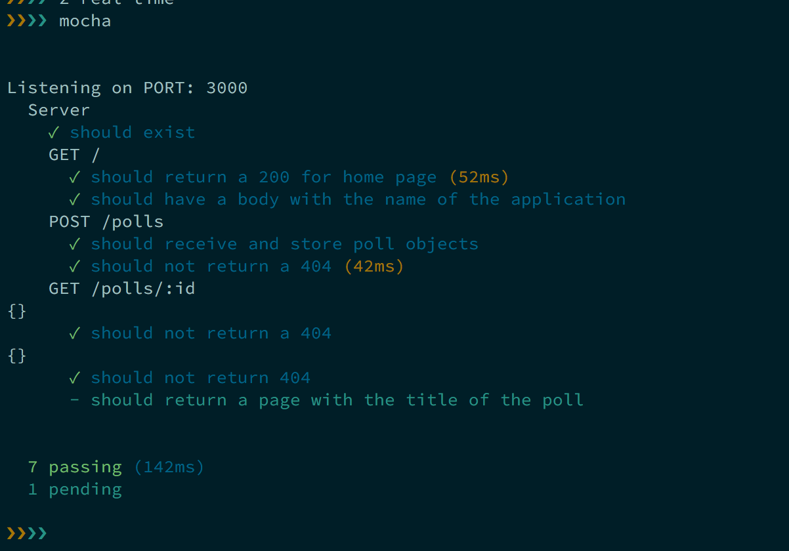

# Real-Time Submission Form
[Project Spec](https://github.com/turingschool/curriculum/blob/master/source/projects/real_time.markdown)

# Basics

### Link to the Github Repository for the Project
[cloud-source](http://github.com/adamki/real-time)

### Link to the Deployed Application
[cloud-source](http://cloud-source.herokuapp.com/)

### Link to Your Commits in the Github Repository for the Project
[Your Commits](https://github.com/adamki/real-time/commits/master)

### Provide a Screenshot of your Application

## Completion

### Were you able to complete what you feel is the base functionality?
#### If not, list what functionality you think may be missing missing.

I was not able to figure out how to use schedule a poll to close. I have since found out that
there is an [npm scheduler](https://www.npmjs.com/package/node-schedule). This would have been handy.

### What features did you complete which you feel 'exceeded expectations'?

My clouds

### Attach a .gif, or images of any extensions work being used on the site.

# Code Quality

### Link to a specific block of your code on Github that you are proud of
#### Why were you proud of this piece of code?

[look at this socket stufff](https://github.com/adamki/real-time/blob/master/server.js#L59-L79) It's so cool!!! im only proud of this in the sense that
if is my "very first websocket". Other than that, it is not terribly exceptional.

### Link to a specific block of your code on Github that you feel not great about
#### Why do you feel not awesome about the code? What challenges did you face trying to write/refactor it?
[testing!!!!](https://github.com/adamki/real-time/blob/master/test/server-test.js)

This testing didn't start until such a late time. I just didn't really get it down like I had hoped. It was rushed, and not excellent testing.

### Attach a screenshot or paste the output from your terminal of the result of your test-suite running.

-----

### Please feel free to ask any other questions or make any other statements below!

## Instructor Feedback

Not saying anything you didn't already know, but while the CSS is super awesome, starting on the feature work for this project a little late definitely hurt you here. The final app isn't done visually (miss-matching visual elements) or functionally (bugs and functionality missing).

Score: 124

Concept and Features

Does it have the expected features?

50 points - Some features were sacrificed to meet the deadline. At best, this is a prototype. Major features covered by the learning goals listed above were not written by the developer.

Code Quality (JavaScript and/or Ruby)

30 points - Developer writes code that is exceptionally clear and well-factored. Application is expertly divided into logical components each with a clear, single responsibility.

Client-Side Application

25 points - Your application is thoughtfully put together with some duplication and no major bugs.

Test-Driven Development

10 points - Many areas of the code are not covered by tests.

Interface

4 points - The application has many strong pages/interactions, but a few holes in lesser-used functionality.

Workflow

5 points - The developer effectively uses Git branches and many small, atomic commits that document the evolution of their application.
