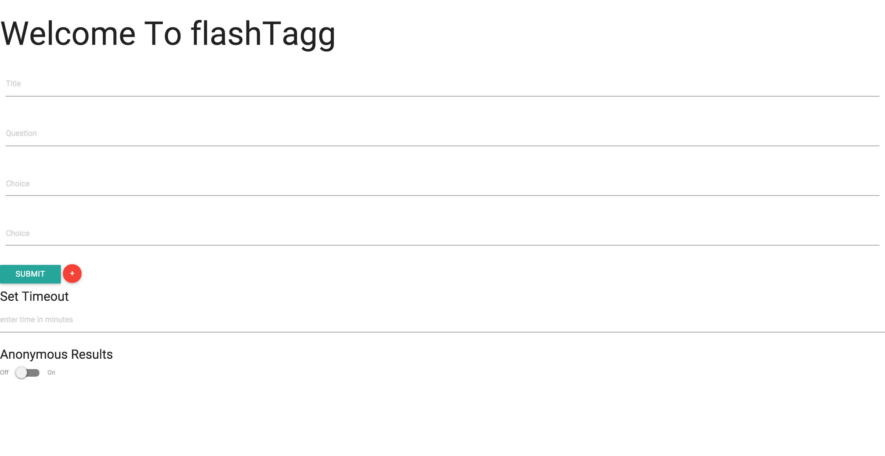
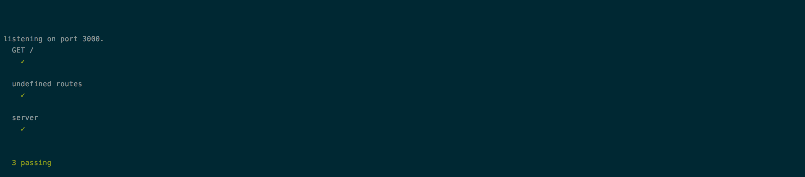

# Real-Time Submission Form
[Project Spec](https://github.com/turingschool/curriculum/blob/master/source/projects/real_time.markdown)

* Fork this repo, if you haven't already and check out a branch
* Use this README as a template to create a file in this folder with your name as the title.
* Submit a pull request
* Pro Tip: You can use [recordit.co](http://recordit.co/) to record interaction gifs.
* Secondary Pro Tip: [Here's how to link to specific line number(s) in Github](http://stackoverflow.com/questions/23821235/how-to-link-to-specific-line-number-on-github)
* Tertiary Pro Tip: You can re-use some of these things in your portfolio/resume

------

# Basics

### Link to the Github Repository for the Project
[Your Repo](https://github.com/joshuajhun/flashTagg)

### Link to the Deployed Application
[Your Application](flashtagg.herokuapp.com)

### Link to Your Commits in the Github Repository for the Project
[Your Commits](https://github.com/joshuajhun/flashTagg/commits/master)

### Provide a Screenshot of your Application

## Completion

### Were you able to complete what you feel is the base functionality?
* I personally believe that I did. The only issue I"m running into is that my application is continually crashing. I have to actually run this command to restart it on heroku (heroku restart --app  flashtagg). Besides that I feel that I did my very best to get the functionality there.

#### If not, list what functionality you think may be missing missing.

### What features did you complete which you feel 'exceeded expectations'?
* To be honest I don't think there are any expectations that I've exceeded. I'm a little down in the dumps when it comes to real time. I really wanted to do well on this project but I think that I struggled with how to use node. Most of my time wasn't spent trying to figure out web sockets. It was spent trying to understand how to use node -____-
### Attach a .gif, or images of any extensions work being used on the site.

# Code Quality

### Link to a specific block of your code on Github that you are proud of
https://github.com/joshuajhun/flashTagg/blob/master/server.js#L43-L62
#### Why were you proud of this piece of code?
* It felt really good to have built this Votes object. It made a lot of sense to me.
### Link to a specific block of your code on Github that you feel not great about
https://github.com/joshuajhun/flashTagg/blob/master/public/client.js#L17-L34
#### Why do you feel not awesome about the code? What challenges did you face trying to write/refactor it?
* I really wish that I had time to refactor. I think this is why I don't like this code. It's not the prettiest or the easist to read.
### Attach a screenshot or paste the output from your terminal of the result of your test-suite running.

### Provide a link to an example, if you have one, of a test that covers an 'edge case' or 'unhappy path'

-----

### Please feel free to ask any other questions or make any other statements below!
* I had a really difficult time with this project. I don't think it's a websockets thing but a framework kind of thing. I also had a lot of difficulty focusing on this project. I feel like these last couple of months I've kind of gone through the ringer and this week put the cherry on top of all of it. All of this to say that this is not my best work. I feel really sad having to submit this because I really just wanted to be able to finally turn in a fully completed project. Anyways. Enough of the sad stuff. Thank you so much for being my instructor(steve/meeka). I realize that I am very blessed to have you both teaching me and exposing me to some really cool things.

## Instructor Feedback

Watch out for the fragility of code - for example, the chaining of `[something].something.somethingElse` which relies on each piece of the chain never returning `undefined` - the bugs that we looked at during the eval seem to all be related to that.

Don't be sad time!

Total Score:  140

Concept and Features -

Does it have the expected features?

75 points - Met expectations as outlined by the user personas, the application is a solid first version. All planned features were delivered.

Code Quality (JavaScript and/or Ruby)

25 points - Developer solves problems with a balance between conciseness and clarity and often extracts logical components. Developer can speak to choices made in the code and knows what every line of code is doing.

Client-Side Application

20 points - Your application has a significant amount of duplication and one or major bugs.

Test-Driven Development

10 points - Many areas of the code are not covered by tests.

Interface

5 points - The application is pleasant, logical, and easy to use

Workflow

5 points - The developer effectively uses Git branches and many small, atomic commits that document the evolution of their application.
