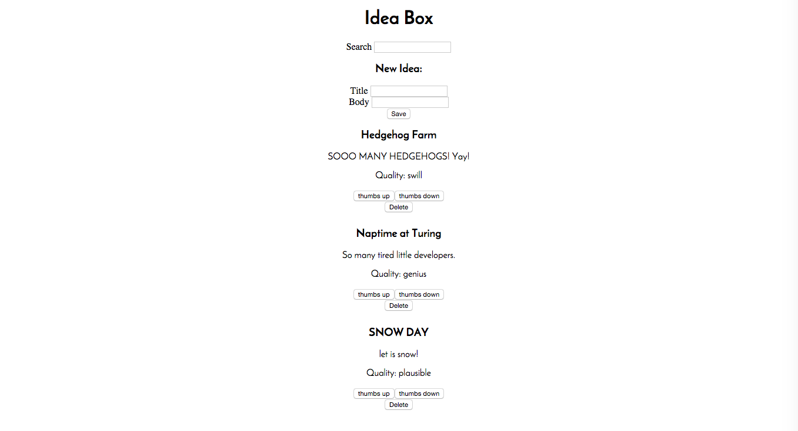
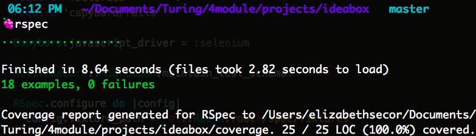

# Ideabox 2.0 Submission Form - Beth Secor

------

# Basics

### Link to the Github Repository for the Project
[Repo](https://github.com/bethsecor/ideabox)

### Link to the Deployed Application
[Application](https://murmuring-woodland-26585.herokuapp.com/)

### Link to Your Commits in the Github Repository for the Project
[Commits](https://github.com/bethsecor/ideabox/commits/master)

### Provide a Screenshot of your Application

## Completion

### Were you able to complete the base functionality?

Yes.

### Which extensions, if any, did you complete?

  * Inline editing of title and body, hitting escape will cancel the changes.

### Attach a .gif, or images of any extensions work being used on the site.

# Code Quality

### Link to a specific block of your code on Github that you are proud of
* [Inline editing of a title](https://github.com/bethsecor/ideabox/blob/master/app/assets/javascripts/application.js#L187). I am proud of this because it took me a while to figure out all of the pieces (undoing the change if they hit escape, unfocusing the edit box when they hit return). I do think it could be more refactored though.

### Link to a specific block of your code on Github that you feel not great about
* [One javascript file](https://github.com/bethsecor/ideabox/blob/master/app/assets/javascripts/application.js), which when I tried to pull them apart into separate files I had issues.

### Attach a screenshot or paste the output from your terminal of the result of your test-suite running.

### Provide a link to an example, if you have one, of a test that covers an 'edge case' or 'unhappy path'

-----

### Please feel free to ask any other questions or make any other statements below!

---

## Points

**Overall Points**: 158

### Project Requirements

* Data Model - 5
* Viewing Ideas - 10
* Adding a New Idea - 15
* Deleting an Existing Idea - 15
* Changing the Quality of the Idea -15
* Editing an Existing Idea - 20
* Idea Filtering and Searching - 15
* Extension - 10 (inline editing)

### Instructor Evaluation Points

* Specification Adherence - 10
* User Interface - 5
* Testing - 10
* Ruby on Rails Quality - 10
* JavaScript Style - 8
* Workflow - 10
