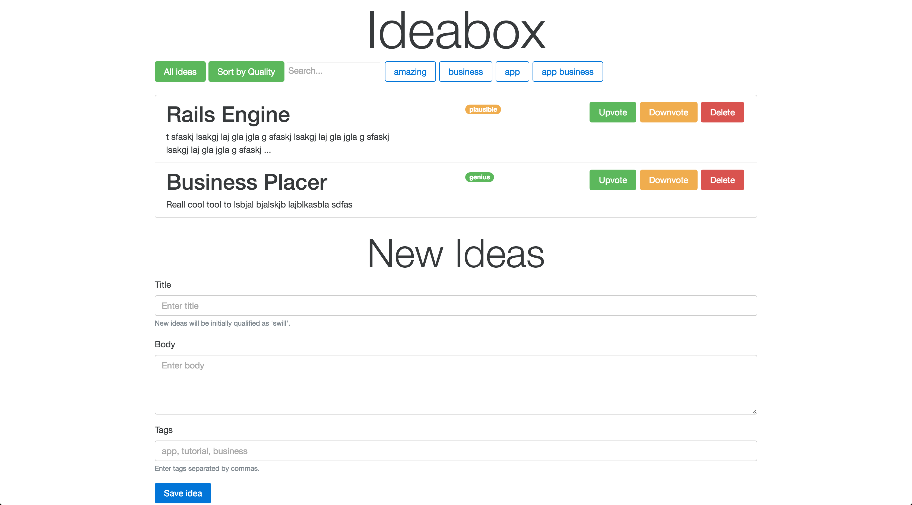

# Ideabox 2.0 Submission Form
[Project Spec](https://github.com/turingschool/curriculum/blob/master/source/projects/revenge_of_idea_box.markdown)

# Basics

### Link to the Github Repository for the Project
[Your Repo](https://github.com/hectorhuertas/ideabox)

### Link to the Deployed Application
[Your Application](https://ideabox-hector.herokuapp.com/)

### Link to Your Commits in the Github Repository for the Project
[Your Commits](https://github.com/hectorhuertas/ideabox/commits/master)

### Provide a Screenshot of your Application


## Completion

### Were you able to complete the base functionality?
* Yes

### Which extensions, if any, did you complete?
* The three of them

### Attach a .gif, or images of any extensions work being used on the site.


# Code Quality

### Link to a specific block of your code on Github that you are proud of

[HtmlFor Module](https://github.com/hectorhuertas/ideabox/blob/d76760e48b129ed15e6dd0892f33cde0469ab735/app/assets/javascripts/HtmlFor.js#L1)
* Why were you proud of this piece of code?
* It is a self-contained purely functional module. It only exposes one method, while keeping all the helpers private. The code inside needs some cleaning, but this is how I want to have all my methods encapsulated.

### Link to a specific block of your code on Github that you feel not great about

[updateIdea function](https://github.com/hectorhuertas/ideabox/blob/d76760e48b129ed15e6dd0892f33cde0469ab735/app/assets/javascripts/main.js#L158-L170)
* Why do you feel not awesome about the code? What challenges did you face trying to write/refactor it?
* There are still things about the ajax calls that I don't understand, mainly when/how synchronicity works, because I would like to make use of promises instead of callbacks. Also, I have to recover and pass all the properties of the idea. Possibly I can find a way of only passing the data I updated

### Attach a screenshot or paste the output from your terminal of the result of your test-suite running.
```
# Running:
....................

Finished in 0.647810s, 30.8732 runs/s, 55.5718 assertions/s.

20 runs, 36 assertions, 0 failures, 0 errors, 0 skips
Coverage report generated for MiniTest to /Users/hectorhuertas/turing/4module/projects/ideabox/coverage.
53 / 54 LOC (98.15%) covered.
```
### Provide a link to an example, if you have one, of a test that covers an 'edge case' or 'unhappy path'
[Cannot upvote a genius idea](https://github.com/hectorhuertas/ideabox/blob/d76760e48b129ed15e6dd0892f33cde0469ab735/test/models/idea_test.rb#L26)

## Points

**Overall Points**: 183

### Project Requirements

* Data Model - 5
* Viewing Ideas - 10
* Adding a New Idea - 15
* Deleting an Existing Idea - 15
* Changing the Quality of the Idea - 15
* Editing an Existing Idea - 20
* Idea Filtering and Searching - 15
* Extensions - 40 (all extensions)

### Instructor Evaluation Points

* Specification Adherence - 10
* User Interface - 5
* Testing - 5
* Ruby on Rails Quality - 10
* JavaScript Style - 8
* Workflow - 10
