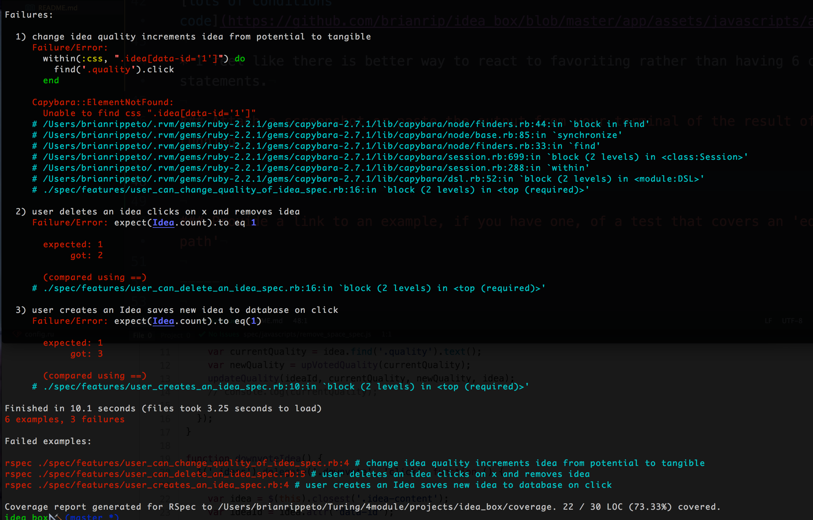

### Link to the Github Repository for the Project
[My Repo](https://github.com/brianrip/idea_box)

### Link to the Deployed Application
[My Application](https://evening-ocean-31041.herokuapp.com/)

### Link to My Commits in the Github Repository for the Project
[My Commits](https://github.com/brianrip/idea_box/commits/master)

### Provide a Screenshot of your Application

## Completion

### Were you able to complete the base functionality?
* Yes, I had a bug last minute with my ideas populating but on than that all base functionality that I know of.

# Code Quality

### Link to a specific block of your code on Github that you are proud of
[edit idea code](http://beesbeesbees.com/)

* I felt like I was able widdle these function down to maintain functionality an easily readable and flexible implementation.

### Link to a specific block of your code on Github that you feel not great about
[lots of conditions code](https://github.com/brianrip/idea_box/blob/master/app/assets/javascripts/adjust_quality.js)

* I feel like there is better way to react to favoriting rather than having 6 conditional if/else statements.

### Attach a screenshot or paste the output from your terminal of the result of your test-suite running.

### Provide a link to an example, if you have one, of a test that covers an 'edge case' or 'unhappy path'
[unhappy](https://github.com/brianrip/idea_box/blob/master/spec/features/user_can_change_quality_of_idea_spec.rb)
-----

### Please feel free to ask any other questions or make any other statements below!

# Instructor Feedback

131/150

### Data Model

(5 points total.)

### User Flows

#### Viewing ideas

(6 points total.)

#### Adding a new idea

(15 points total.)

#### Deleting an existing idea

(15 points total.)

#### Changing the quality of an idea

(15 points total.)

#### Editing an existing idea

(18 points total.)

#### Idea Filtering and Searching

(15 points total.)

### Instructor Evaluation Points

#### Specification Adherence

10 points: The application consists of one page with all of the major functionality being provided by jQuery. There is no use of format.js in Rails. There is no use of unobstrusive JavaScript. There are no front-end frameworks used in the application. No approach was taken that is counter to the spirit of the project and its learning goals. There are no features missing from above that make the application feel incomplete or hard to use.

#### User Interface

3 points - The application has many strong pages/interactions, but a few holes in lesser-used functionality.

#### Testing

5 points - Project has sporadic use of tests and multiple levels. Not all controller actions are tested. There are little or no attempts at integration testing.

#### Ruby and Rails Quality

8 points - Developer solves problems with a balance between conciseness and clarity and often extracts logical components. Developer can speak to choices made in the code and knows what every line of code is doing.

#### JavaScript Style

8 points - Application is thoughtfully put together with some duplication and no major bugs. Developer can speak to choices made in the code and knows what every line of code is doing.

#### Workflow

8 points - The developer makes a series of small, atomic commits that document the evolution of their application. There are no formatting issues in the code base.
