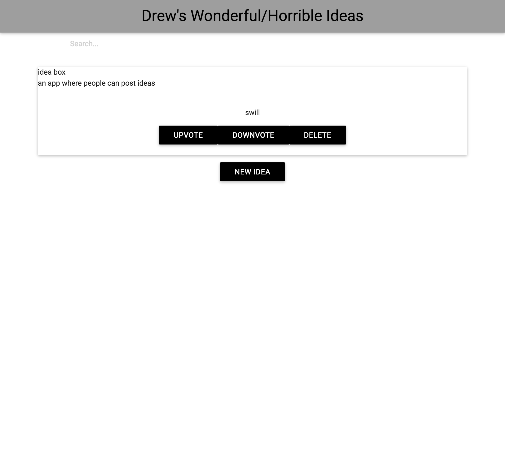

# Drew Ideabox 2.0 Submission
[Project Spec](https://github.com/turingschool/curriculum/blob/master/source/projects/revenge_of_idea_box.markdown)

------

# Basics

### Link to the Github Repository for the Project
[Ideabox](https://github.com/drew-t/idea_box)

### Link to the Deployed Application
[Idea Box](http://drews-ideas.herokuapp.com/)

### Link to Your Commits in the Github Repository for the Project
[Commits](https://github.com/drew-t/idea_box/commits/master)

### Provide a Screenshot of your Application

## Completion

### Were you able to complete the base functionality?
No.

* Ideas limited to 100 characters when displayed.

### Which extensions, if any, did you complete?
Did not get to them.

### Attach a .gif, or images of anys extensions work being used on the site.

# Code Quality

### Link to a specific block of your code on Github that you are proud of
[ideas.js](https://github.com/drew-t/idea_box/blob/master/app/assets/javascripts/ideas.js)
* I liked the way I found to create a callback which is comprised of another method.

### Link to a specific block of your code on Github that you feel not great about
[edit_idea.js](https://github.com/drew-t/idea_box/blob/master/app/assets/javascripts/edit_idea.js#L21-L35)

* This just feels ugly and long, but I'm not sure what to do about it.

### Attach a screenshot or paste the output from your terminal of the result of your test-suite running.
.....

Finished in 0.27887 seconds (files took 3.59 seconds to load)
5 examples, 0 failures

### Provide a link to an example, if you have one, of a test that covers an 'edge case' or 'unhappy path'

-----

134/150

### Data Model

(5 points total.)

### User Flows

#### Viewing ideas

5 points

(missing truncation)

#### Adding a new idea

(15 points total.)

#### Deleting an existing idea

(15 points total.)

#### Changing the quality of an idea

(15 points total.)

#### Editing an existing idea

(20 points total.)

#### Idea Filtering and Searching

(15 points total.)

## Instructor Evaluation Points

### Specification Adherence

* **10 points**: The application consists of one page with all of the major functionality being provided by jQuery. There is no use of `format.js` in Rails. There is no use of unobstrusive JavaScript. There are no front-end frameworks used in the application. No approach was taken that is counter to the spirit of the project and its learning goals. There are no features missing from above that make the application feel incomplete or hard to use.

### User Interface

* **5 points** - The application is pleasant, logical, and easy to use. There no holes in functionality and the application stands on it own to be used by the instructor _without_ guidance from the developer.

### Testing

* **5 points** - Project has sporadic use of tests and multiple levels. Not all controller actions are tested. There are little or no attempts at integration testing.

### Ruby and Rails Quality

* **8 points** - Developer solves problems with a balance between conciseness and clarity and often extracts logical components. Developer can speak to choices made in the code and knows what every line of code is doing.

### JavaScript Style

* **7 points** - Your application has some duplication and minor bugs. Developer can speak to most choices made in the code and knows what every line is doing.

### Workflow

* **9 points** - The developer effectively uses Git branches and many small, atomic commits that document the evolution of their application.
