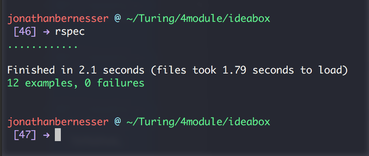

### Link to the Github Repository for the Project
[MyRepo](https://github.com/Jbern16/ideabox)

### Link to the Deployed Application
[Deployed](https://idea-in-a-box.herokuapp.com/)

### Link to Your Commits in the Github Repository for the Project
[My Commits](https://github.com/Jbern16/ideabox/commits/master)

### Provide a Screenshot of your Application

## Completion

### Were you able to complete the base functionality?
Yes.

### Which extensions, if any, did you complete?
Sort and Self-Directed - I implemented a Binary JSON Data Store in postgres to store my ideas data.
This makes querying very fast! It added a few hurdles for some of the Ajax calls and default quality.

### Attach a .gif, or images of any extensions work being used on the site.
[Sort Gif](http://recordit.co/qbEhHUb2RO)
# Code Quality

### Link to a specific block of your code on Github that you are proud of
[Proud Code](https://github.com/Jbern16/ideabox/blob/master/app/assets/javascripts/service_helpers.js.es6#L1-L21)

I like this piece of code because it seperated each part of the idea I append, generically. If selectors change, or I need to add specific attributes
to what is being append, I just have to do it in one place. It was super maintainable throughout the project

### Link to a specific block of your code on Github that you feel not great about
[Not Proud Code](https://github.com/Jbern16/ideabox/blob/master/app/assets/javascripts/service_helpers.js.es6#L22-L35)

Although this piece of code is clever in how it truncates words on the first word break after 100, I like. However, I believe it is a messy 
implementation and in its current state, many parts of it can be extracted out.

### Attach a screenshot or paste the output from your terminal of the result of your test-suite running.

### Provide a link to an example, if you have one, of a test that covers an 'edge case' or 'unhappy path'
[Edge Case](https://github.com/Jbern16/ideabox/blob/master/spec/features/user_can_edit_quality_spec.rb#L24-L43)
-----

### Please feel free to ask any other questions or make any other statements below!

### Data Model
​
(5 points total.)
​
We'll be primarily working with _Idea_ objects.
​
* An Idea has a _title_, a _body_, and a _quality_. (1 point)
  * _title_ and _body_ are free-form strings.
* _quality_ can be represented however you feel best in the database,
  but in the user interface it should manifest as the options "genius", "plausible", and "swill" (2 points)
* By default, the idea's "quality" should default to the lowest setting (i.e. "swill"). (2 points)
​
### User Flows
​
#### Viewing ideas
​
(10 points total.)
​
On the application's root, the user should:
​
* See a list of all existing ideas, including the title, body, and quality for each idea. (2 points, mandatory for specification adherence)
* Idea bodies longer than 100 characters should be truncated to the nearest word. (5 points)
* Ideas should appear in descending chronological order (with the most recently created
  idea at the top). (3 points)
​
#### Adding a new idea
​
(15 points total.)
​
On the application's main page, a user should:
​
* See two text boxes for entering the "Title" and "Body" for a new idea,
  and a "Save" button for committing that idea. (3 points, mandatory for specification adherence)
​
When a user clicks "Save":
​
* A new idea with the provided title and body should appear in the idea list. (5 points, mandatory for specification adherence)
* The text fields should be cleared and ready to accept a new idea. (2 points)
* The page _should not_ reload. (3 points, mandatory for specification adherence)
* The idea should be committed to the database. It should still be present upon reloading the page. (2 points, mandatory for specification adherence)
​
#### Deleting an existing idea
​
(15 points total.)
​
When viewing the idea list:
​
* Each idea in the list should have a link or button to "Delete" (or 𝗫, etc). (2 points)
* Upon clicking "Delete", the appropriate idea should be removed from the list (5 points, mandatory for specification adherence).
* The page _should not_ reload when an idea is deleted. (5 points, mandatory for specification adherence)
* The idea should be removed from the database. It should not re-appear on next page load. (3 points, mandatory for specification adherence)
​
#### Changing the quality of an idea
​
(15 points total.)
​
As we said above, ideas should start out as "swill." In order to change the recorded quality of an idea, the user will interact with it from the idea list.
​
* Each idea in the list should include a "thumbs up" and "thumbs down" button. (3 points)
* Clicking thumbs up on the idea should increase its quality one notch ("swill" → "plausible",
  "plausible" → "genius"). (4 points)
* Clicking thumbs down on the idea should decrease its quality one notch ("genius" → "plausible",
  "plausible" → "swill"). (4 points)
* Incrementing a "genius" idea or decrementing a "swill" idea should have no effect. (4 points)
​
#### Editing an existing idea
​
(20 points total.)
​
* When a user clicks the title or body of an idea in the list, that text should become an editable text field, pre-populated with the existing idea title or body. (8 points)
* Clicking this link should _not_ take the user to a separate "edit" page for the given
  idea. (4 points, mandatory for specification adherence)
*  The user should be able to "commit" their changes by pressing "Enter/Return" or by clicking outside of the text field. (4 points)
* If the user reloads the page, their edits will be reflected. (4 points, mandatory for specification adherence)
​
#### Idea Filtering and Searching
​
(15 points total.)
​
We'd like our users to be able to easily find specific ideas they already created, so
let's provide them with a filtering interface on the idea list.
​
* At the top of the idea list, include a text field labeled "Search". (3 points)
* As a user types in the search box, the list of ideas should filter in real time to only display ideas whose title or body include the user's text. The page _should not_ reload. (6 points)
* Clearing the search box should restore all the ideas to the list. (6 points)
​
### Extensions
​
Extensions are a great way to earn additional points beyond the 150 available in this project. That said, awarding points for delivering a given extension is up to the instructor, who may only award partial points depending on the quality of the implementation. The points listed below represent the maximum number of points. Extensions can _not_ be done after the fact without instructor permission in advance.
​
#### Sorting
​
(10 additional points.)
​
When viewing the ideas list, the user should have the option to sort ideas by Quality. The default sort should be descending ("genius" → "plausible" → "swill"), and clicking the sort a second time should reverse it. The Idea list should be sorted client-side without reloading the page.
​
#### Student Directed Extension
​
(10 additional points.)
​
Student chooses an additional feature or performance optimization to add to the project. The extension must be intuitive and should not detract from the user's experience in any major way (i.e. not buggy or incomplete).
​
## Instructor Evaluation Points
​
### Specification Adherence
​
* **10 points**: The application consists of one page with all of the major functionality being provided by jQuery. There is no use of `format.js` in Rails. There is no use of unobstrusive JavaScript. There are no front-end frameworks used in the application. No approach was taken that is counter to the spirit of the project and its learning goals. There are no features missing from above that make the application feel incomplete or hard to use.
​
### User Interface
​
* **5 points** - The application is pleasant, logical, and easy to use. There no holes in functionality and the application stands on it 
​
### Testing
​
* **10 points** - Project has a running test suite that exercises the application at multiple levels including JavaScript tests.
​
### Ruby and Rails Quality
​
* **10 points** - Developer is able to craft Rails features that make smart use of Ruby, follow the principles of MVC, and push business logic down where it belongs. There _zero_ instances where an instructor would recommend taking a different approach. Developer writes code that is exceptionally clear and well-factored. Application is expertly divided into logical components each with a clear, single responsibility.
### JavaScript Style
​
* **9 points** - Application has exceptionally well-factored code with little or no duplication and all components separated out into logical components. There _zero_ instances where an instructor would recommend taking a different approach.

### Workflow
​
* **10 points** - The developer effectively uses Git branches and many small, atomic commits that document the evolution of their application.

### score 169
