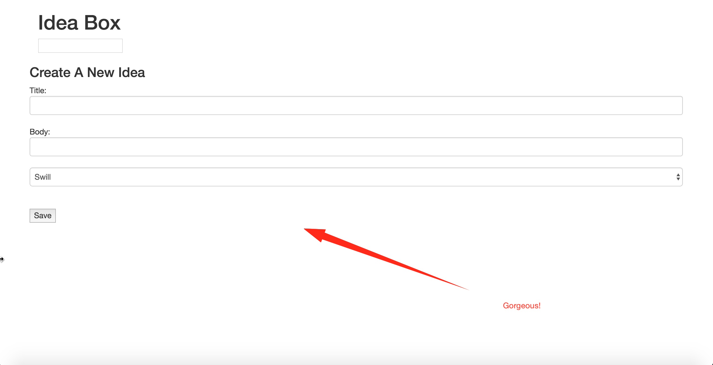

# Ideabox 2.0 Submission Form
[Project Spec](https://github.com/turingschool/curriculum/blob/master/source/projects/revenge_of_idea_box.markdown)

* Fork this repo, if you haven't already and check out a branch
* Use this README as a template to create a file in this folder with your name as the title.
* Submit a pull request
* Pro Tip: You can use [recordit.co](http://recordit.co/) to record interaction gifs.
* Secondary Pro Tip: [Here's how to link to specific line number(s) in Github](http://stackoverflow.com/questions/23821235/how-to-link-to-specific-line-number-on-github)
* Tertiary Pro Tip: You can re-use some of these things in your portfolio/resume

------

# Basics

### Link to the Github Repository for the Project
[Your Repo](https://github.com/kristindiannefoss/idea_box)

### Link to the Deployed Application
[Your Application](https://brick-me.herokuapp.com/)

### Link to Your Commits in the Github Repository for the Project
[Your Commits](https://github.com/kristindiannefoss/idea_box/commits/master)

### Provide a Screenshot of your Application

## Completion

### Were you able to complete the base functionality?
* Nupe.  The best way I can describe my performance on this project is absolute paralysis.  I dropped the ball.  And then just stared at it on the ground.  I realize I'm going to be struggling to catch up.  

### Which extensions, if any, did you complete?
None.

### Attach a .gif, or images of any extensions work being used on the site.

# Code Quality

### Link to a specific block of your code on Github that you are proud of
*

### Link to a specific block of your code on Github that you feel not great about
*

### Attach a screenshot or paste the output from your terminal of the result of your test-suite running.

### Provide a link to an example, if you have one, of a test that covers an 'edge case' or 'unhappy path'

-----

### Please feel free to ask any other questions or make any other statements below!

  -----------

## Instructor feedback

77/150
### Data Model

(5/5 points total.)

### User Flows

#### Viewing ideas

(5/10 points total.)

On the application's root, the user should:

* Idea bodies longer than 100 characters should be truncated to the nearest word. (5 points)

#### Adding a new idea

(15 points total.)

#### Deleting an existing idea

(15 points total.)

When viewing the idea list:

#### Changing the quality of an idea

(3/15 points total.)

As we said above, ideas should start out as "swill." In order to change the recorded quality of an idea, the user will interact with it from the idea list.

* Clicking thumbs up on the idea should increase its quality one notch ("swill" → "plausible",
  "plausible" → "genius"). (4 points)
* Clicking thumbs down on the idea should decrease its quality one notch ("genius" → "plausible",
  "plausible" → "swill"). (4 points)
* Incrementing a "genius" idea or decrementing a "swill" idea should have no effect. (4 points)

#### Editing an existing idea

(0/20 points total.)

* If the user reloads the page, their edits will be reflected. (4 points, mandatory for specification adherence)

#### Idea Filtering and Searching

(0/15 points total.)

## Instructor Evaluation Points

### Specification Adherence

* **10 points**: The application consists of one page with all of the major functionality being provided by jQuery. There is no use of `format.js` in Rails. There is no use of unobstrusive JavaScript. There are no front-end frameworks used in the application. No approach was taken that is counter to the spirit of the project and its learning goals. There are no features missing from above that make the application feel incomplete or hard to use.

### User Interface

* **3/10 points** - The application has many strong pages/interactions, but a few holes in lesser-used functionality.

### Testing

* **2/10 points** - There is little or no evidence of testing in this application - Evidence of attempts at testing at the beginning of unit tests.

### Ruby and Rails Quality

* **8/10 points** - Developer solves problems with a balance between conciseness and clarity and often extracts logical components. Developer can speak to choices made in the code and knows what every line of code is doing.

- Watch comments and unused code

### JavaScript Style

* **5/10 points** - Your application has some duplication and minor bugs. Developer can speak to most choices made in the code and knows what every line is doing. 

- Not entirely sure what some of the code is doing
- Bugs in the thumbs up/down functionality and editing an idea
- Significant opportunities to refactor in ajax calls/long methods/comments

- Looks like developer was headed in a good direction and had ideas about how to fix bugs, just didn't get there

### Workflow

* **10/10 points** - The developer effectively uses Git branches and many small, atomic commits that document the evolution of their application.

