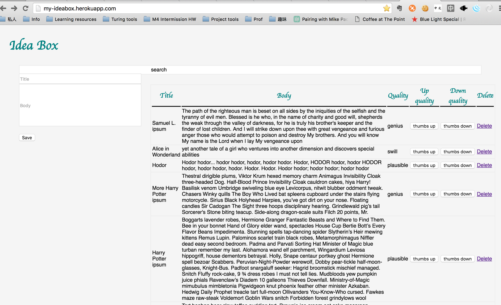
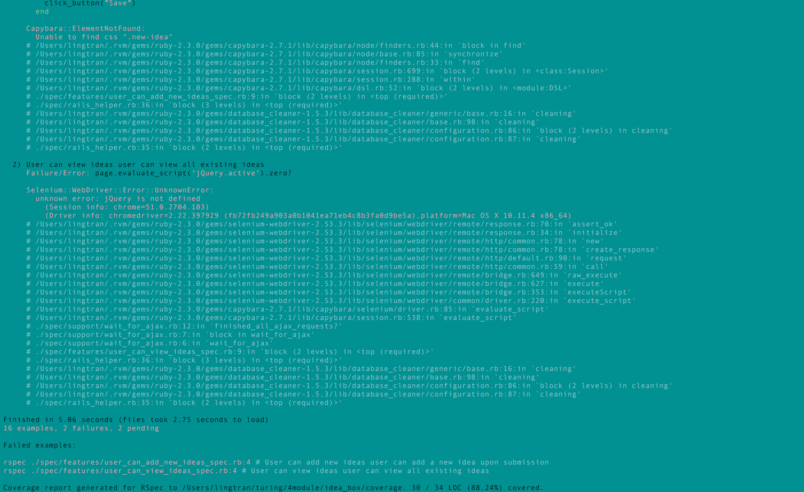

# Ideabox 2.0 Submission Form
[Project Spec](https://github.com/turingschool/curriculum/blob/master/source/projects/revenge_of_idea_box.markdown)

* Fork this repo, if you haven't already and check out a branch
* Use this README as a template to create a file in this folder with your name as the title.
* Submit a pull request
* Pro Tip: You can use [recordit.co](http://recordit.co/) to record interaction gifs.
* Secondary Pro Tip: [Here's how to link to specific line number(s) in Github](http://stackoverflow.com/questions/23821235/how-to-link-to-specific-line-number-on-github)
* Tertiary Pro Tip: You can re-use some of these things in your portfolio/resume

------

# Basics

### Link to the Github Repository for the Project
[Your Repo](https://github.com/lingtran/idea_box)

### Link to the Deployed Application
[Idea Box](http://my-ideabox.herokuapp.com/)

### Link to Your Commits in the Github Repository for the Project
[Your Commits](https://github.com/lingtran/idea_box/commits/master)

### Provide a Screenshot of your Application


## Completion

### Were you able to complete the base functionality?
* Yes

### Which extensions, if any, did you complete?
* Self-directed extension - escaping filtered search

### Attach a .gif, or images of any extensions work being used on the site.

```
function escapeSearch(ideas, behavior) {
  $('.search-field').delegate('.search-idea', behavior, function(e){
    if (behavior === 'keyup'){
      $('.search-field').attr('contentEditable', 'false');
      if (e.keyCode === 27){
        $(this).empty();
        $('.new-idea').show();
        ideas.show();
      }
    } else {
      $(this).empty();
      $('.new-idea').show();
      ideas.show();
    }
  })
}
```

### Link to a specific block of your code on Github that you are proud of
* Inline editing and search functionalities

### Link to a specific block of your code on Github that you feel not great about
* Why do you feel not awesome about the code? What challenges did you face trying to write/refactor it?
* https://github.com/lingtran/idea_box/blob/master/app/assets/javascripts/services_renderers_enablers.js.es6#L37-74
  - the enabler functions are not so DRY
* https://github.com/lingtran/idea_box/blob/master/app/assets/javascripts/formatters.js.es6#L11-50
  - the ```prepend``` and ```append``` functions are not so DRY
* Challenge of considering writing a dynamic function that does not rely so much on conditionals

### Attach a screenshot or paste the output from your terminal of the result of your test-suite running.


### Provide a link to an example, if you have one, of a test that covers an 'edge case' or 'unhappy path'

-----

### Please feel free to ask any other questions or make any other statements below!

-----

# Instructor feedback

157/ 150

Really strong use of es6 and breaking things out. Cool feature for extra credit. Duplication of code in the JS is really the only thing to point out, but as you keep learning about `this` it'll be easier to refactor (probably already easier actually).

### Data Model
​
(5 points total.)
​
### User Flows
​
#### Viewing ideas
​
(10 points total.)
​
#### Adding a new idea
​
(15 points total.)
​
#### Deleting an existing idea
​
(15 points total.)
​
#### Changing the quality of an idea
​
(15 points total.)
​
#### Editing an existing idea
​
(20 points total.)
​
#### Idea Filtering and Searching
​
(15 points total.)
​
### Extensions
​
Extensions are a great way to earn additional points beyond the 150 available in this project. That said, awarding points for delivering a given extension is up to the instructor, who may only award partial points depending on the quality of the implementation. The points listed below represent the maximum number of points. Extensions can _not_ be done after the fact without instructor permission in advance.

​
#### Student Directed Extension
​
(10 additional points.)

​
## Instructor Evaluation Points
​
### Specification Adherence
​
* **10 points**: The application consists of one page with all of the major functionality being provided by jQuery. There is no use of `format.js` in Rails. There is no use of unobstrusive JavaScript. There are no front-end frameworks used in the application. No approach was taken that is counter to the spirit of the project and its learning goals. There are no features missing from above that make the application feel incomplete or hard to use.
​
### User Interface
​
* **5 points** - The application is pleasant, logical, and easy to use. There no holes in functionality and the application stands on it own to be used by the instructor _without_ guidance from the developer.

### Testing
​
* **8 points** - Project has a running test suite that tests and multiple levels but fails to cover some features. All controller actions are covered by tests. The application makes some use of integration testing.
​
### Ruby and Rails Quality
​
* **10 points** - Developer is able to craft Rails features that make smart use of Ruby, follow the principles of MVC, and push business logic down where it belongs. There _zero_ instances where an instructor would recommend taking a different approach. Developer writes code that is exceptionally clear and well-factored. Application is expertly divided into logical components each with a clear, single responsibility.

### JavaScript Style
​
* **9 points** - Application is thoughtfully put together with some duplication and no major bugs. Developer can speak to choices made in the code and knows what every line of code is doing.
​
### Workflow
​
* **10 points** - The developer effectively uses Git branches and many small, atomic commits that document the evolution of their application.
