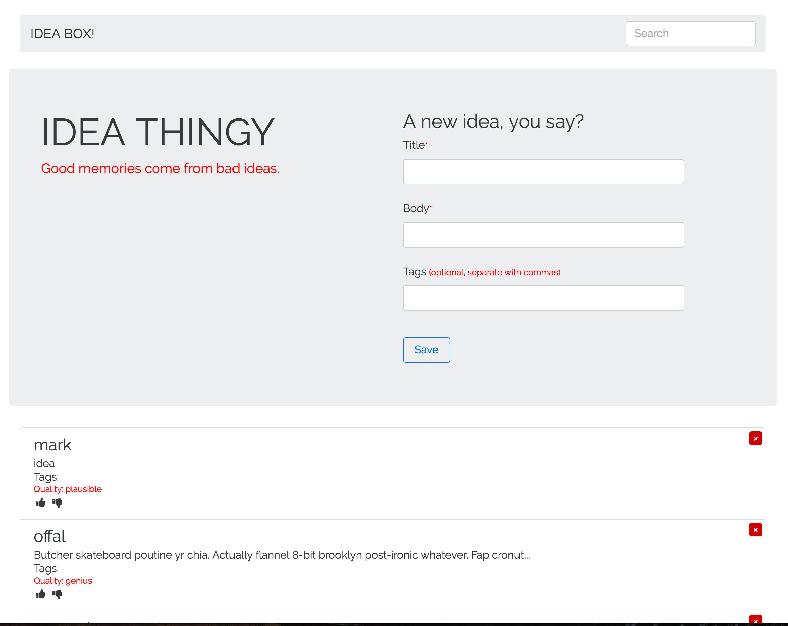

# Mark Ideabox 2.0 Submission
[Project Spec](https://github.com/turingschool/curriculum/blob/master/source/projects/revenge_of_idea_box.markdown)

------

# Basics

### Link to the Github Repository for the Project
[Ideabox](https://github.com/notmarkmiranda/idea-box)

### Link to the Deployed Application
[Idea Thingy](http://ideathingy.herokuapp.com/)

### Link to Your Commits in the Github Repository for the Project
[Commits](https://github.com/notmarkmiranda/idea-box/commits/master)

### Provide a Screenshot of your Application


## Completion

### Were you able to complete the base functionality?
Yes!


### Which extensions, if any, did you complete?
I started tags, did not finish them.

### Attach a .gif, or images of anys extensions work being used on the site.

# Code Quality

### Link to a specific block of your code on Github that you are proud of
[search_box.js](https://github.com/notmarkmiranda/idea-box/blob/master/app/assets/javascripts/search_box.js)
* I feel like this is sometihng I was terrified about actually implementing. I'm proud of how clean it is and compact the code is.

### Link to a specific block of your code on Github that you feel not great about
[vote.js](https://github.com/notmarkmiranda/idea-box/blob/master/app/assets/javascripts/vote.js)

* I feel like I could've refactored this into at least one less function

### Attach a screenshot or paste the output from your terminal of the result of your test-suite running.
```
[idea-box] (master) rspec

Idea validations
  should validate that :title cannot be empty/falsy
  should validate that :body cannot be empty/falsy
  should have many idea_tags
  should have many tags through idea_tags

IdeaTag validations
  should belong to idea
  should belong to tag

Tag validations
  should validate that :name cannot be empty/falsy
  should have many idea_tags
  should have many ideas through idea_tags

post /api/v1/ideas
  POST#create
  POST#create, with one tag
  POST#create, with two tags
  POST#create, with three tags

delete /api/v1/ideas
  DELETE#destroy

update /api/v1/ideas - happy paths
  PATCH#update - +1
  PATCH#update - -1

update /api/v1/ideas - sad paths - 1
  PATCH#update - -1
  PATCH#update - +1

get /api/v1/ideas
  GET#index

Finished in 1.01 seconds (files took 4.61 seconds to load)
19 examples, 0 failures
```

### Provide a link to an example, if you have one, of a test that covers an 'edge case' or 'unhappy path'

[Rating not impacted by invalid ratings](https://github.com/notmarkmiranda/idea-box/blob/d60803626433810069a01298ed61aaf3e66b7826/spec/requests/user_updates_an_idea_spec.rb#L24-L28)

-----

### Data Model
​
(5 points total.)
​
We'll be primarily working with _Idea_ objects.
​
* An Idea has a _title_, a _body_, and a _quality_. (1 point)
  * _title_ and _body_ are free-form strings.
* _quality_ can be represented however you feel best in the database,
  but in the user interface it should manifest as the options "genius", "plausible", and "swill" (2 points)
* By default, the idea's "quality" should default to the lowest setting (i.e. "swill"). (2 points)
​
### User Flows
​
#### Viewing ideas
​
(10 points total.)
​
On the application's root, the user should:
​
* See a list of all existing ideas, including the title, body, and quality for each idea. (2 points, mandatory for specification adherence)
* Idea bodies longer than 100 characters should be truncated to the nearest word. (5 points)
* Ideas should appear in descending chronological order (with the most recently created
  idea at the top). (3 points)
​
#### Adding a new idea
​
(15 points total.)
​
On the application's main page, a user should:
​
* See two text boxes for entering the "Title" and "Body" for a new idea,
  and a "Save" button for committing that idea. (3 points, mandatory for specification adherence)
​
When a user clicks "Save":
​
* A new idea with the provided title and body should appear in the idea list. (5 points, mandatory for specification adherence)
* The text fields should be cleared and ready to accept a new idea. (2 points)
* The page _should not_ reload. (3 points, mandatory for specification adherence)
* The idea should be committed to the database. It should still be present upon reloading the page. (2 points, mandatory for specification adherence)
​
#### Deleting an existing idea
​
(15 points total.)
​
When viewing the idea list:
​
* Each idea in the list should have a link or button to "Delete" (or 𝗫, etc). (2 points)
* Upon clicking "Delete", the appropriate idea should be removed from the list (5 points, mandatory for specification adherence).
* The page _should not_ reload when an idea is deleted. (5 points, mandatory for specification adherence)
* The idea should be removed from the database. It should not re-appear on next page load. (3 points, mandatory for specification adherence)
​
#### Changing the quality of an idea
​
(15 points total.)
​
As we said above, ideas should start out as "swill." In order to change the recorded quality of an idea, the user will interact with it from the idea list.
​
* Each idea in the list should include a "thumbs up" and "thumbs down" button. (3 points)
* Clicking thumbs up on the idea should increase its quality one notch ("swill" → "plausible",
  "plausible" → "genius"). (4 points)
* Clicking thumbs down on the idea should decrease its quality one notch ("genius" → "plausible",
  "plausible" → "swill"). (4 points)
* Incrementing a "genius" idea or decrementing a "swill" idea should have no effect. (4 points)
​
#### Editing an existing idea
​
(20 points total.)
​
* When a user clicks the title or body of an idea in the list, that text should become an editable text field, pre-populated with the existing idea title or body. (8 points)
* Clicking this link should _not_ take the user to a separate "edit" page for the given
  idea. (4 points, mandatory for specification adherence)
*  The user should be able to "commit" their changes by pressing "Enter/Return" or by clicking outside of the text field. (4 points)
* If the user reloads the page, their edits will be reflected. (4 points, mandatory for specification adherence)
​
#### Idea Filtering and Searching
​
(15 points total.)
​
We'd like our users to be able to easily find specific ideas they already created, so
let's provide them with a filtering interface on the idea list.
​
* At the top of the idea list, include a text field labeled "Search". (3 points)
* As a user types in the search box, the list of ideas should filter in real time to only display ideas whose title or body include the user's text. The page _should not_ reload. (6 points)
* Clearing the search box should restore all the ideas to the list. (6 points)
​

​

## Instructor Evaluation Points
​
### Specification Adherence
​
* **10 points**: The application consists of one page with all of the major functionality being provided by jQuery. There is no use of `format.js` in Rails. There is no use of unobstrusive JavaScript. There are no front-end frameworks used in the application. No approach was taken that is counter to the spirit of the project and its learning goals. There are no features missing from above that make the application feel incomplete or hard to use.
​
### User Interface
​

* **5 points** - The application is pleasant, logical, and easy to use. There no holes in functionality and the application stands on it own to be used by the instructor _without_ guidance from the developer.

​
### Testing

* **8 points** - Project has a running test suite that tests and multiple levels but fails to cover some features. All controller actions are covered by tests. The application makes some use of integration testing.

​
### Ruby and Rails Quality
​

* **10 points** - Developer is able to craft Rails features that make smart use of Ruby, follow the principles of MVC, and push business logic down where it belongs. There _zero_ instances where an instructor would recommend taking a different approach. Developer writes code that is exceptionally clear and well-factored. Application is expertly divided into logical components each with a clear, single responsibility.

​
### JavaScript Style
​

* **8 points** - Application is thoughtfully put together with some duplication and no major bugs. Developer can speak to choices made in the code and knows what every line of code is doing.


​
### Workflow
​
* **4 points** - The developer makes large commits covering multiple features that make it difficult for the evaluator to determine the evolution of the application.


### Please feel free to ask any other questions or make any other statements below!

### total score : 140
