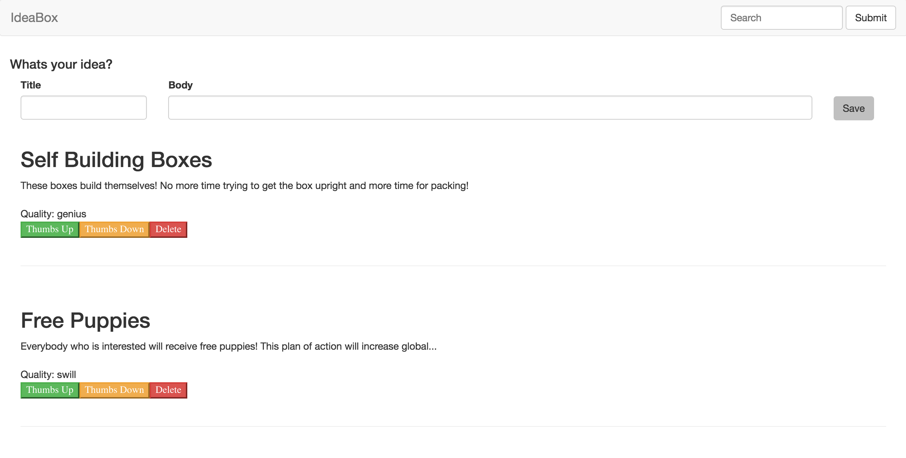

## Parker Phillips, Idea Box

### Important Links:

[Github Repo](https://github.com/ExCaelum/idea-box)

[Production Link](https://floating-cliffs-42121.herokuapp.com/)

[Github Commits](https://github.com/ExCaelum/idea-box/commits/master)

### Screenshot:

### Completion:
##### Were you able to complete the base functionality?
I was able to complete the basic functionality

##### Which extensions, if any, did you complete?
I did not complete any extensions

### Code Quality:
##### Link to a specific block of code on Github that you are proud of
 [Building Ideas on document.ready](https://github.com/ExCaelum/idea-box/blob/master/app/assets/javascripts/build_ideas.js)

##### Why were you proud of this piece of code?
I am proud of this code because this is the first piece of JS that I have written that I understand. I feel like it definitely could be better, but I am proud of the way it turned out and the way it functions for it being my first piece of JavaScript code.

##### Link to a specific block of your code on Github that you feel not great about
[Voting](https://github.com/ExCaelum/idea-box/blob/master/app/assets/javascripts/voting.js)

##### Why do you feel not awesome about the code? What challenges did you face trying to write/refactor it?
I was really struggling with keeping the logic in JS. I had issues making the JS communicate with the enum quality for ideas. I was forced to move the logic of updating into the idea model itself, and I would have liked to figure out how to do it in JavaScript.

##### Attach a screenshot or past the output from your terminal of the result of your test-suite running.

##### Provide a link to an example, if you have one, of a test that covers an 'edge case' or 'unhappy path'
[Github Link - Sad Path Test - Error on create with no/invalid data](https://github.com/ExCaelum/idea-box/blob/master/test/controllers/api/v1/ideas_controller_test.rb)

## Rubric

### Data Model

(5 points total.)

### User Flows

#### Viewing ideas

(10 points total.)

#### Adding a new idea

(15 points total.)

#### Deleting an existing idea

(15 points total.)

#### Changing the quality of an idea

(15 points total.)

#### Editing an existing idea

(20 points total.)

#### Idea Filtering and Searching

(15 points total.)

### Extensions

Extensions are a great way to earn additional points beyond the 150 available in this project. That said, awarding points for delivering a given extension is up to the instructor, who may only award partial points depending on the quality of the implementation. The points listed below represent the maximum number of points. Extensions can _not_ be done after the fact without instructor permission in advance.

#### Tagging

(20 additional points.)

Add an optional third text field upon idea creation for "Tags". Tags should be a comma-separated list of short text tags, and should be processed on the server such that any existing tags are re-used, and any new ones are created. Once there are tags to display, a list of existing tags should appear at the top of the idea list. Clicking one of these tags should show only ideas that include it. When viewing ideas filtered by tag, be sure to include a link to take the user back to "All Ideas". This filtering could be implemented either as a separate page or via javascript within the same interface.

#### Sorting

(10 additional points.)

When viewing the ideas list, the user should have the option to sort ideas by Quality. The default sort should be descending ("genius" → "plausible" → "swill"), and clicking the sort a second time should reverse it. The Idea list should be sorted client-side without reloading the page.

#### Student Directed Extension

(10 additional points.)

Student chooses an additional feature or performance optimization to add to the project. The extension must be intuitive and should not detract from the user's experience in any major way (i.e. not buggy or incomplete).

## Instructor Evaluation Points

### Specification Adherence

* **10 points**: The application consists of one page with all of the major functionality being provided by jQuery. There is no use of `format.js` in Rails. There is no use of unobstrusive JavaScript. There are no front-end frameworks used in the application. No approach was taken that is counter to the spirit of the project and its learning goals. There are no features missing from above that make the application feel incomplete or hard to use.

### User Interface

* **5 points** - The application is pleasant, logical, and easy to use. There no holes in functionality and the application stands on it own to be used by the instructor _without_ guidance from the developer.

### Testing

* **8 points** - Project has a running test suite that tests and multiple levels but fails to cover some features. All controller actions are covered by tests. The application makes some use of integration testing.

### Ruby and Rails Quality

* **9 points** - Developer solves problems with a balance between conciseness and clarity and often extracts logical components. Developer can speak to choices made in the code and knows what every line of code is doing.
* **5 points** - Developer writes effective code, but does not breakout logical components. Application shows some effort to break logic into components, but the divisions are inconsistent or unclear. There are many large methods or functions and it is not clear to the evaluator what a given section of code does. Developer cannot speak to every line of code on the server side.
* **3 points** - Developer writes code with unnecessary variables, operations, or steps which do not increase clarity.
* **0 points** - Developer writes code that is difficult to understand. Application logic shows poor decomposition with too much logic mashed together.

### JavaScript Style

* **7 points** - Application is thoughtfully put together with some duplication and no major bugs. Developer can speak to choices made in the code and knows what every line of code is doing.
* **5 points** - Your application has some duplication and minor bugs. Developer can speak to most choices made in the code and knows what every line is doing.
* **3 points** - Your application has a significant amount of duplication and one or more major bugs. Developer cannot speak to most choices and does not know what every line of code is doing.
* **1 point** - Your client-side application does not function or the application does not make use of AJAX using jQuery for updating information on the client. Developer writes code with unnecessary variables, operations, or steps which do not increase clarity.
* **0 points** - There is little or no client-side code. Developer writes code that is difficult to understand. Application logic shows poor decomposition with too much logic mashed together.

### Workflow

* **10 points** - The developer effectively uses Git branches and many small, atomic commits that document the evolution of their application.
